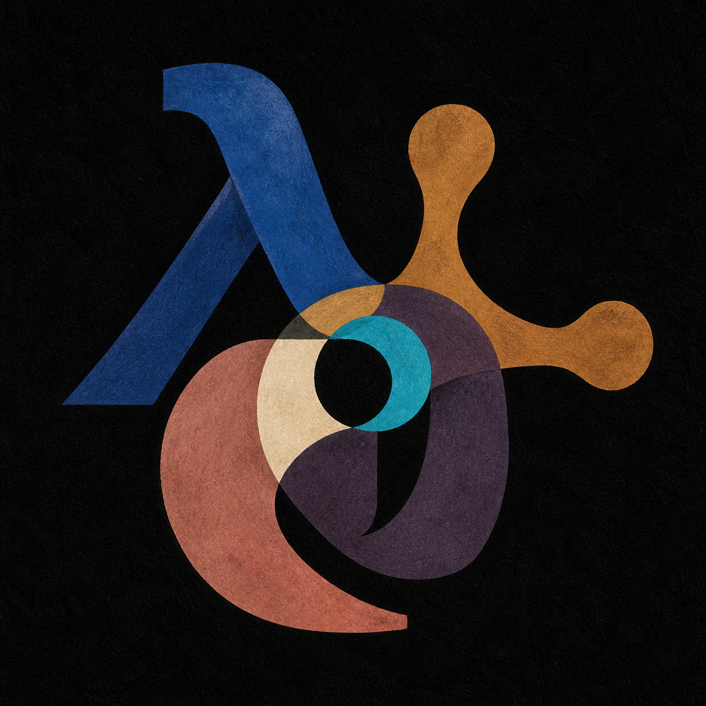
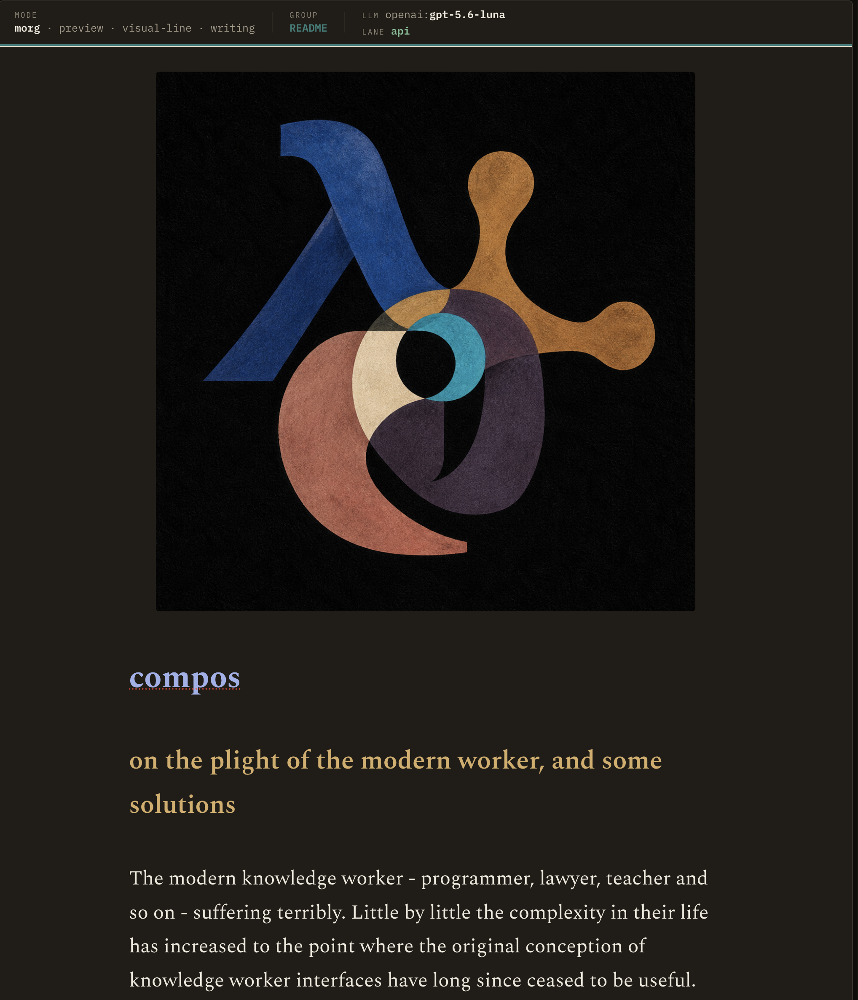

# compos

## on the plight of the modern worker, and some solutions

The modern knowledge worker - programmer, lawyer, teacher and so on - suffering terribly. Little by little the complexity in their life has increased to the point where the original conception of knowledge worker interfaces have long since ceased to be useful. The dominant computing paradigm of floating windows disconnected from each other visually and contextually is woefully out of date. 

We can tell it is woefully out of date because computer use remains a hard problem. The agents cannot manipulate your computer easily. Now this might be secure by design and what not, any number of reasons, but you can't deny that it sure makes it hard to get stuff done.

Multiple browser windows and profiles with dozens of tabs each, none of them accessible directly and each with their own context locked away behind a browser dom and hidden amongst a litany of tailwind classes and also a hundred-odd nextjs imports. Neither human nor agent can work here.

## a proposal for a new UX

well forgive me if I overstate the case here. It's not a new UX. It's one of the earliest UXs in computers, built back when only power users could even get access to a computer. And it is time for it to make a comeback.

The core philosophy is simple - you do not go to your context, your context comes to you. now whether that's your email, your issue tracker, your rss feed - all of it is brought into the environment into a uniform access pattern with all your tools available for it.

Then you can compose your context perfectly for any task you might have. Any agent can work on any buffer or multiple buffers connecting the various text in your life - from error traces to sales decks.


## Emacs rebuilt on the BEAM.

Compos is a headless editor daemon in Elixir, scripted in Scheme, rendered by the browser. You can think of it as a modernised emacs - more computation environment than text editor. AIs then write small scheme programs to manipulate the buffer states to give you the desired output. This eliminates the need for a lot of wasteful mcp tool calls and slow LLM mediated roundtrips in favour of direct access to all your data as structured data. You build your perfect work environment by talking to it.

## Philosophy

Emacs has the right model for an agent harness. Buffers hold durable application state. Windows compose views. Named commands give people and agents one semantic action surface. Modes add contextual behavior, and the Lisp runtime keeps the whole environment open to inspection and change.

The missing pieces are modern rendering and concurrency. Compos uses the browser as a renderer without adopting the browser's closed application model. The main window can show a rich application while chat remains beside it. The agent manipulates the same buffers, windows, and commands that the person uses.

Elixir and OTP keep model streams, tools, terminals, and background work from blocking the interface.

This approach also explains why we do not need a large plugin lifecycle framework. JavaScript frameworks such as Cordis must reconstruct dynamic composition above a module graph. Lisp starts with symbols, late binding, live evaluation, and inspectable state. OTP owns the external resources that still
need explicit lifetimes.

Read the longer arguments:

- [The New Browser Was Emacs All Along](docs/EMACS-AS-AGENT-HARNESS.md)
- [Cordis, Lisp, and What JavaScript Has to Rebuild](docs/CORDIS-VS-EMACS.md)

## The one rule

**Elixir supplies mechanism. Scheme decides policy.**

Elixir owns the work that loops over bytes: ropes, tree-sitter, sockets, PTYs, schedulers, the LLM transport. Scheme owns everything a person calls "the editor": commands, keymaps, modes, hooks, themes, dired, org-mode, chat, mail. That is 17,000 lines of Scheme in apps/compos_core/priv/*.scm`, and 321 commands. You redefine any of them while the editor runs.

Before we add Elixir code, we ask one question: can this be Scheme plus one small primitive? The answer is usually yes.

Policy is a convenience, not an OS security boundary. The user, their init file, and their agents can invoke the mechanisms exposed to Scheme, including processes and the shell. Permission prompts are useful, replaceable Scheme guardrails; core does not hard-code a weaker mechanism surface for agents.

Use OS accounts, containers, and scoped credentials when isolation is needed.

## Why the BEAM

One GenServer holds each buffer. Agents are supervised processes. A blocking tool call cannot freeze redisplay, because it blocks its own process and nothing else. The core is a headless daemon, so every frontend is a client: the browser, the desktop shell, `nc`, or an agent over JSON-RPC.

Every buffer mutation broadcasts a change event with **provenance** —
`:user`, `:editor`, `:process`, or `{:agent, id}`. Provenance is
load-bearing. Read-only buffers block `:user` edits only, and the reactor ignores agent-sourced edits, so agents do not trigger themselves.

## What works

### Editing


Rope buffers, Emacs undo with amalgamation and
redo-after-break, mark and region, kill ring, isearch, completion in the minibuffer and in the buffer, and per-window points that markers keep correct across edits.

Write directly in an almost WYSIWYG editor for a beautiful, distraction free writing environment. The editor never loses state and is pleasantly fast. 

### Frames and windows — tiling splits with ratio geometry. Each attached
browser gets its own frame, its own window tree, and its own minibuffer.
Clients reattach by frame id across page reloads and daemon restarts.

### Persistence — everything survives a restart. 
`~/.compos/desktop.etf` holds buffers, window trees, points, and faces. File buffers reopen from disk. Chat and agent buffers restore their content and their local state.

**Tree-sitter** — a Rustler NIF gives font-lock, structural navigation, and queries. `M-x ts-install-grammar` fetches a grammar from inside the editor.

### AI 
Chat is available anywhere the point is. You also get dedicated companion chats per buffer or per group so you can provide it specific context. Connect direct via API, drive your agents through ACP or codex-app-server protocol - so you can bring the tools and contexts you use today. 

### Observability 
Compos ships with decent telemetry support - whether it's for the scheme runtime, tool calls tracing for time and token budgets or for running chats through RL - all the tools you have to make your agent fast and correct are all there.

### Applications, all in userland Scheme
I've built some of the core applications — org-mode, spreadsheets, notmuch mail, git and diff-mode, project, an MCP client and server hub, a GraphQL client, a Spotify remote, a writing workspace, a code browser, dired, ibuffer, help, a secrets manager .... and the next one is one short chat away.

The environment is designed to be extended by you to shape you. The emacs-style customisability makes Compos a natural home for your solo ware. Agents are hand tuned for this and writing your next context gatherer is as simple as `C-c q` "get the fireflies API key from doppler and build me the app"


## Layout

```
apps/compos_scheme   the extension language: values are BEAM terms
apps/compos_core     buffers, editor state, primitives, NIFs, procs, LLM
  priv/*.scm        the editor itself
  native/compos_ts   tree-sitter Rustler NIF
apps/compos_ui       Phoenix LiveView frontend (a client — no editor logic)
apps/compos_rpc      JSON-RPC over ~/.compos/sock ("eval is the API")
```

Your config loads from `~/.compos/ai-config.scm`, then `~/.compos/init.scm`.
Both are optional.

## Run it

```sh
mix deps.get && mix test
mix run --no-halt
open -na "Google Chrome" --args --app=http://localhost:4004
```

The daemon reads `priv/*.scm` at boot, so a restart reloads them. Browser
clients reload themselves through a boot-id check.

Each daemon records its name and URL in `~/.compos/daemons.json`. Run another
daemon with a different home and port, then use `C-x d` to switch the current
browser tab. Set `COMPOS_DAEMON_REGISTRY` when the daemons must share another
registry path.

```sh
COMPOS_HOME=~/.compos-feature COMPOS_PORT=4014 COMPOS_APP_PORT=4015 \
  COMPOS_NAME=feature COMPOS_ACCENT="#3f7cac" mix run --no-halt
```

`COMPOS_ACCENT` adds a persistent colored frame and instance label. Use a
six-digit CSS hex color so each daemon has a stable visual identity.

In the window: `C-x 2/3/o/1/0` splits windows, `C-x C-f` finds a file,
`C-x C-s` saves, `C-x b` switches buffers, `C-k` and `C-y` kill and yank,
`C-/` undoes, `M-x` runs a command, and `M-:` evaluates Scheme.

## Drive it from outside

`eval` is the whole API. One round-trip runs any multi-step action:

```sh
printf '%s\n' '{"jsonrpc":"2.0","id":1,"method":"eval","params":{"code":"(buffer-list)"}}' \
  | nc -U ~/.compos/sock
```

A **buffer link** is one string that names a buffer. `C-x l` copies an
`compos://` link for the current buffer and line. The link includes the daemon's
socket, so it returns to the instance that created it. On macOS, register the
protocol handler once:

```sh
bin/install-compos-url-handler
```

Open the same buffer name under `/raw/` to read its text:

```sh
curl -s http://localhost:4004/raw            # every buffer name, one per line
curl -s http://localhost:4004/raw/%2Ftmp%2Fnotes.md
```

## Extend it

A command is a Scheme definition. Evaluate this with `M-:` and the editor
has it — no restart, no compile step:

```scheme
(domain! 'text)
(effects! '(write))

(define-command "insert-buffer-name" "Insert the name of this buffer"
  (lambda () (insert! (current-buffer))))

(global-set-key "C-c n" "insert-buffer-name")
```

Every public definition carries catalog metadata — a `domain!` and an effects!` scope. `M-x apropos` searches that catalog by words and, when an OpenAI key is configured, by semantic similarity. Literal hits still rank first; catalog vectors are synchronized in the background when public entries
change, cached on disk, and regenerated explicitly with
`M-x apropos-rebuild-embeddings`. Foreground lookup embeds only the query. The Scheme API remains
`(apropos QUERY &rest FILTERS)`.

## Design commitments

1. **Tree-sitter is the sensor.** Buffers are syntax trees. Send the
   function, not the file.
2. **Scheme is the brain.** If an app could plausibly be written in Scheme, it is. Symbols are `{:sym, "name"}`, never atoms — user code must not
   grow the atom table.
3. **RPC first.** The socket predates the UI. Headless is the default, and MCP is a thin layer over the same core.
4. **Display list, not grid.** Frontends render `{text, face}` spans plus embedded components. A grid frontend degrades gracefully.
5. **Everything survives a reload.** A new buffer kind must keep this true.

## Known limitations

- **Env frames are never collected.** Every closure call adds a frame to the interpreter store, so long sessions grow. The fix is a reachability sweep or ETS-backed envs.
- The rope has no rebalancing.
- The Scheme has no `define-syntax` and no continuations.
- RPC is newline-delimited and has no auth. Keep it on the local socket.
And probably a thousand more. This is still alpha software.

## Documentation

`docs/` holds the architecture, the roadmap, the component contract, and the current handoff. Read [`docs/ARCHITECTURE.md`](docs/ARCHITECTURE.md) first.

## License

See [`LICENSE`](LICENSE).
