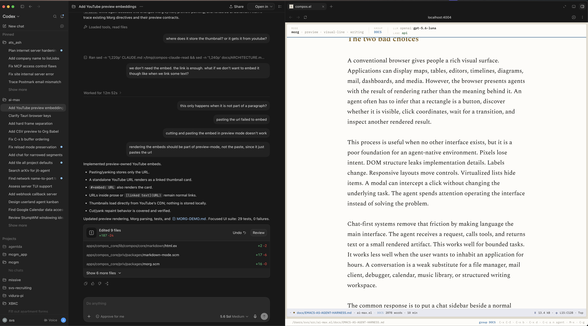
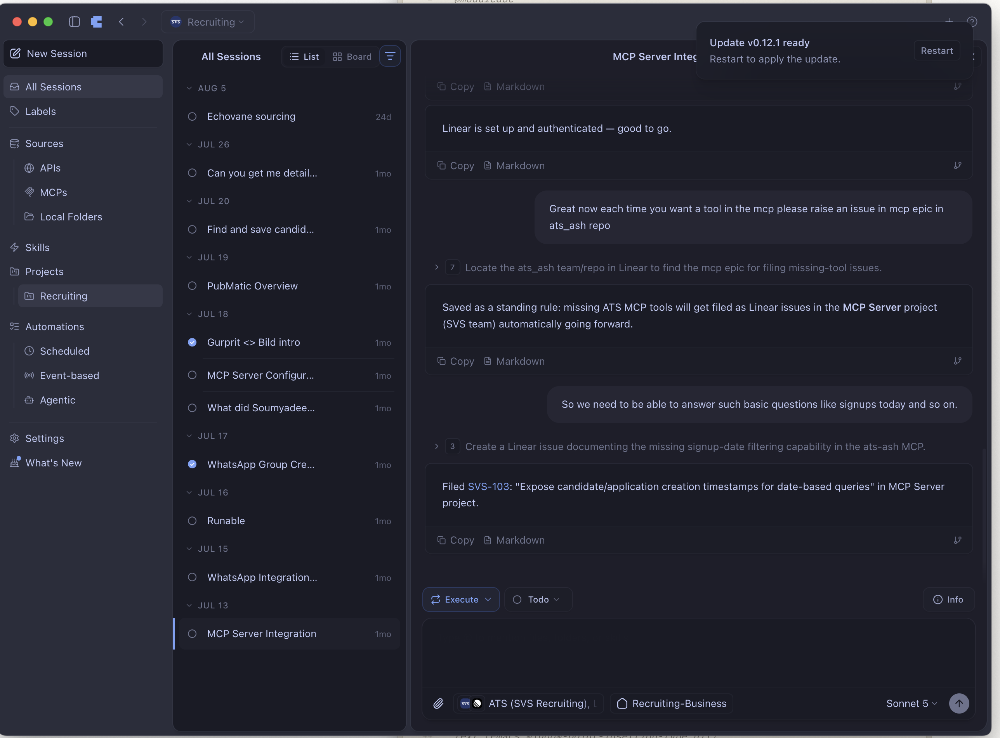

# The New Browser Was Emacs All Along

I have wanted to invent a new browser for years. and years. Not another engine for HTML, CSS, and JavaScript, but a new environment for using~ software: a rendered application in the main area, a persistent conversation beside it, and an agent that can operate the application with me. The user should keep the visual interface. The agent should get a precise semantic interface. Both should act on the same state.

Most attempts deliver only half of that idea. Browser agents preserve the rendered application, but they understand it through screenshots, accessibility trees, selectors, and simulated clicks. Chat applications give the agent a clean language interface, but reduce the application to messages and generated cards. One approach has a good interface for people and a poor interface for agents. The other has a good interface for agents and a poor environment for serious human work.

Emacs suggests how to combine them. Its important idea is not that every other stupid application should look like a text editor. Its important idea is that an application can expose one live, programmable environment to users, extensions, and automation. Buffers hold durable state. Windows present buffers. Commands provide named actions. Modes supply contextual behavior. The evaluator can inspect and change the running system. An agent harness needs almost exactly these properties.

The new browser may not need a new browser model after all. It may need the Emacs philosophy with modern rendering, concurrency, and agents.

## The two bad choices

A conventional browser gives people a rich visual surface. Applications can display maps, tables, editors, timelines, diagrams, mail, dashboards, and media. However, the browser presents agents with the result of rendering rather than the meaning behind it. An agent often has to infer that a rectangle is a button, discover whether it is visible, click coordinates, wait for a transition, and inspect another rendered result.

This process is useful when no other interface exists, but it is a poor foundation for an agent-native environment. Pixels lose intent. DOM structure leaks implementation details. Labels change. Responsive layouts move controls. Virtualized lists hide items. A modal can intercept a click without changing the underlying task. The agent spends attention operating the interface instead of solving the problem.

Chat-first systems remove that friction by making language the main interface. The agent receives a request, calls tools, and returns text or a small rendered artifact. This works well for bounded tasks. It works less well when the user wants to inhabit an application for hours. A conversation is a weak substitute for a file manager, mail client, debugger, calendar, music library, or structured writing workspace.

*Ok, now what? *

Literally everything needs to be sent to the agent or you need to switch to the application where things get done. No in-between.

The common response is to put a chat sidebar beside a normal application. That improves the layout, but not the architecture. The sidebar often belongs to a separate assistant service. It receives a summary of application state and invokes a narrow set of actions. The application remains closed, while the assistant remains outside it. They share a screen but not a runtime.

The better design starts with one environment. The rendered application and the conversation become two views into the same live system. The agent does not need to imitate a mouse, and the user does not need to abandon the application for a chat transcript.

## What Emacs understood

Emacs calls nearly everything a buffer. A file is a buffer, but so are help, mail, compilation results, a shell, a directory listing, a process, and a conversation. This does not mean every application becomes plain text. It means each application gets an addressable state object with common operations and a place in the window system.

This uniformity produces leverage. A user can split a window, place related buffers beside each other, switch them, save them, link to them, search them, and run commands against them. A package can add a new kind of application without negotiating with a fixed collection of page types. Once the package supplies a mode and commands, the new application joins the environment.

Commands matter even more than buffers. Emacs actions have names. A key binding, menu item, Lisp expression, user, macro, or external client can invoke the same command. The graphical gesture is not the action. It is one way to request the action. This separation creates a semantic control surface before anyone mentions agents.

Modes add context. The meaning of a key or command can depend on the active buffer without fragmenting the whole environment into isolated applications. Hooks let extensions respond to events. Buffer-local variables hold application state. Lisp keeps these structures inspectable and changeable while Emacs runs. The system remains open at the exact points where an agent needs discovery and control.

Emacs also refuses the assumption that the vendor must design every workflow. Users can compose commands, redefine behavior, and build applications inside the environment. That openness is unusually suitable for agents because agents are dynamic extension authors. They do not only select existing menu items. They discover capabilities, combine them, and sometimes create the missing operation.

## An agent needs semantics, not pixels

An agent-native environment should make every meaningful action available as a named command with a documented contract. “Select the next message,” “archive this thread,” “split the window,” “open this file,” and “replace this syntax node” are semantic operations. Clicking the third row or sending a key chord is only presentation.

The agent should discover commands by name, description, domain, argument shape, and effects. It should learn whether an operation reads, writes, executes, spends money, contacts an external service, or destroys data. This catalog becomes the equivalent of menus for an agent. It also gives the permission system meaningful units to approve.

The same command must serve the person and the agent. If the person presses a key, the input layer resolves it to a command. If the agent calls a tool, the tool resolves to that command. If a rendered component receives a click, its action resolves to that command. Multiple interfaces then share one policy instead of implementing similar behavior three times.

This design changes observability. The system can record that an agent invoked `archive-thread`, not merely that synthetic input clicked position `(842, 391)`. It can attach provenance to every mutation: user, editor, process, or a specific agent. Read-only rules can block user edits while allowing a process to append output. Reactive automation can ignore agent-created changes and avoid feedback loops.

Semantic actions do not remove the graphical interface. They free it to become richer. The renderer can display a table, card, timeline, tree, image, or embedded control without becoming the only way to operate the underlying application. Humans receive visual density and direct manipulation. Agents receive stable names and structured values.

## The chat sidebar is a real window

In this environment, chat should not be a floating assistant pasted onto every application. It should be another durable buffer shown in an ordinary window. The user can place it beside a file, mail listing, document, terminal, or dashboard. The window arrangement expresses the working context.

Because chat belongs to the same environment, it does not need a fictional copy of application state. It can refer to actual buffer identities, selections, syntax trees, processes, and windows. The agent can open a result in another window, select it, modify it through commands, and leave the conversation visible. The person watches the same state change that the agent caused.

This is the best part of the browser idea. The main area remains an application, not an endless transcript. Chat remains available, not hidden behind a modal or a separate site. The agent can manipulate the visible workspace, but it does so through the environment's semantics. The user can interrupt, undo, inspect, or continue manually at any time.

A conversation can also become an application in its own right. Tool calls can render as foldable cards. Permission requests can use the minibuffer. Agent tasks can appear as buffers with modes, keymaps, progress, and persistent state. The distinction between “assistant UI” and “application UI” becomes unnecessary because both use the same rendering and command system.

## Rich rendering without surrendering the system

Traditional Emacs rendering is the obvious limitation. Text grids, overlays, faces, and terminal-era layout rules cannot express every modern application well. A new environment should preserve the buffer and command model without preserving the display constraints.

The frontend can render structured blocks, components, proportional text, images, tables, rich cards, and application-specific layouts. It can use a browser engine as a display technology without accepting the browser's application architecture. The daemon remains the source of truth. The frontend renders its state and sends semantic input back.

This boundary is important. If application state migrates into hidden frontend components, the shared environment breaks. The agent sees one state, the person sees another, and reloads lose the connection between them. A pure renderer keeps windows replaceable. A web client, desktop shell, terminal client, or agent can consume the same underlying state at different levels of fidelity.

Rich rendering should therefore be a projection, not a private world. Selection, folds, navigation, and durable application state belong to the application mode. Components receive that state through explicit properties. Clicks return identifiers that the command layer understands. The renderer can be sophisticated while remaining subordinate to the programmable environment.

## Concurrency completes the model

Emacs supplies the right philosophy but not the ideal execution substrate for agent work. A long tool call, parser, or network request should not freeze the interface. Several agents should work at once. Terminals, language servers, model streams, and background jobs need independent lifetimes and failure isolation.

The BEAM fits this side of the design. A buffer can be a process. An agent can run under supervision. A blocking tool call can wait without stopping redisplay. Links and monitors can report failures. The system can terminate a task and clean up its resources without restarting the whole environment.

Lisp and OTP divide the work naturally. Lisp decides what commands mean, which modes apply, how applications behave, and what policy permits. Elixir handles sockets, PTYs, parsers, schedulers, persistence, and raw buffer mechanics. One side keeps the environment open and programmable. The other makes it concurrent and reliable.

This combination matters because an agent harness is not only a tool-calling loop. It is a long-running operating environment for people, models, processes, and applications. It needs extension, rendering, concurrency, persistence, permissions, and recovery. Emacs provides the conceptual shape. OTP provides the operational foundation.

## A browser for applications and agents

Calling this environment a browser is useful if we recover the older meaning of browsing. A browser lets a person move through an information space, follow links, keep several places open, inspect sources, and invoke applications attached to documents. The web browser narrowed that idea around pages and origins. An Emacs-like agent environment can widen it again around buffers and commands.

Every buffer can have a stable link. Opening the link selects the application and restores the relevant position. A file, chat, help page, agent task, mail search, or generated view can participate in the same navigation system. Windows become composable views rather than tabs owned by unrelated sites. Commands cross application boundaries because the environment, not each page, owns control.

The agent then becomes a participant in the browser rather than a visitor pretending to be a user. It can inspect the catalog, invoke commands, create buffers, arrange windows, and render results. Its actions remain visible and attributable. The person can use the mouse and keyboard where direct manipulation is faster, then ask the agent to perform a semantic transformation where language is better.

That is the best of both worlds. It keeps the rendered application, visual context, and manual control that make browsers useful. It adds the symbolic command surface, inspectable state, and extensibility that make Lisp environments powerful. Chat becomes a persistent collaborator beside the work. The agent manipulates the real interface without being trapped inside its pixels.

The new browser I wanted was not a smarter collection of web pages. It was a live application environment shared by the user and the agent. Emacs had already supplied the difficult idea: keep the system open, make actions semantic, and let every application participate in one programmable world. What remained was modern rendering, modern concurrency, and a model capable of using it.

## Further reading
https://www.youtube.com/watch?v=DMbrNhx2zWQ
- [GNU Emacs Lisp Reference Manual](https://www.gnu.org/software/emacs/manual/html_node/elisp/)
- [ai-max.el architecture](ARCHITECTURE.md)
- [ai-max.el AI-native plan](AI-NATIVE-SPEC.md)
- [ai-max.el component system](COMPONENTS.md)
