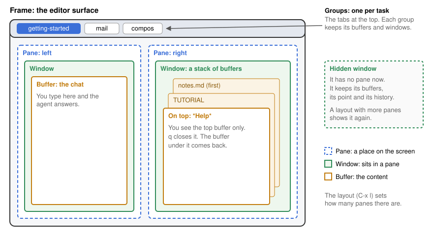

# Windows: a guide to the screen

This page tells you what you see on the screen and how the parts fit
together. Read it once, and the window keys will make sense.

## The parts, from the outside in

**Frame.** The whole editor surface: one browser tab or one app window.

**Group.** One task: its buffers and its windows. The tabs in the top bar
are the groups. When you switch group, the frame shows that group's windows
as you left them. A group never shows a buffer of another group.

**Layout.** The shape of the frame: one pane, two panes, three columns,
rows, or free. The layout sets how many panes there are. A new group starts
with three columns, and its windows fill the columns as you open buffers.

**Pane.** A place on the screen, for example "left" or "right". A pane
holds one window.

**Window.** It sits in a pane and shows one buffer. Each window keeps its
own point and scroll, so two windows can show the same buffer at two
different places.

**Buffer.** The content: a file, a chat, a help page, a directory listing,
a mail thread, a web page. Almost everything you see is a buffer, so the
same keys work on all of them.

## A window is a stack of buffers

A window remembers the buffers it showed, in order. You see only the buffer
on top.

When you open a help page in a window that shows the tutorial, the help
page goes on top of the tutorial. Press `q` on the help page: it closes,
and the tutorial comes back in the same window, at the same place.

Each window has its own stack. Closing a buffer in one window never brings
back a buffer from another window.

## Hidden windows

A window can exist without a pane. This is a hidden window. It keeps its
buffers, its point and its history.

When you change to a layout with fewer panes, the extra windows become
hidden. They do not close. When you change back to a layout with more
panes, they come back as they were.

## Closing is not killing

- **Close a window** (`C-x 0`): the window leaves the screen. Its buffers
  stay open.
- **Close a buffer in a window** (`q` on a help page, a list or a popup):
  the buffer under it in that window comes back.
- **Kill a buffer** (`C-x k`): the content goes. Each window that showed it
  shows its own previous buffer. The layout stays.

## Keys

| Key | What it does |
| --- | --- |
| `C-x o` | Go to the next window |
| `s-<left>`, `s-<right>` | Go to the window on the left or the right |
| `C-x 3` | Split this window into two, side by side |
| `C-x 2` | Split this window into two, one above the other |
| `C-x 0` | Close this window |
| `C-x 1` | Keep only this window |
| `C-x b` | Show another buffer in this window |
| `S-<left>` | Go back to the buffer you used before |
| `C-x C-b` | List every buffer, by group |
| `C-x k` | Kill a buffer |
| `C-M-v` | Scroll the other window, and stay here |
| `C-c <left>`, `C-c <right>` | Go back to an earlier arrangement of windows, or forward again |
| `C-x g` | Switch to another group |
| `C-x C-g n` | Make a new group |

## Layouts

Press `C-x l` to choose a layout. Then press one key:

| Key after `C-x l` | Layout |
| --- | --- |
| `1` | One window |
| `2` | Two panes: 2/3 and 1/3 |
| `=` | Two equal panes |
| `c` | Three columns |
| `r` | Two rows |
| `+` | Two equal panes, and the group's chat in a narrow pane |
| `f` | Free: you split by hand |

A layout arranges the windows that the group has. It does not open more
buffers to fill a pane.

## Where next

- `C-h t` opens the tutorial. Its "Windows" and "Files and buffers"
  lessons let you practise the keys above.
- [How do I ...?](manual/HOW-DO-I.md) gives short recipes for buffers,
  windows and groups.
- [The window specification](WINDOWS-SPEC.md) gives the exact rules and
  the test cases. Not every case there is verified.
