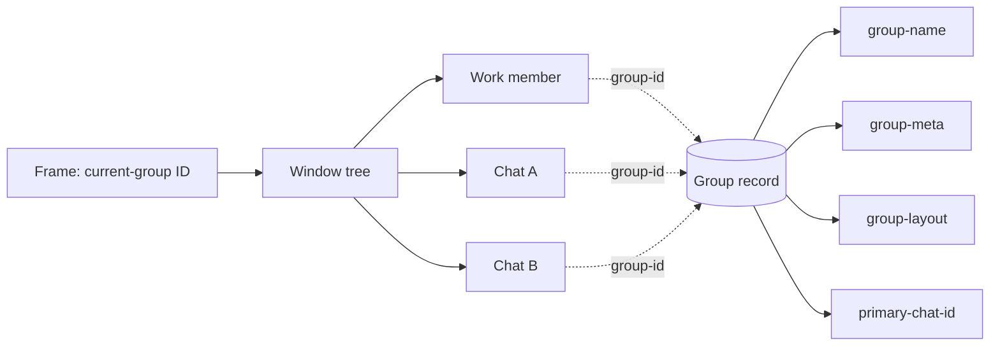
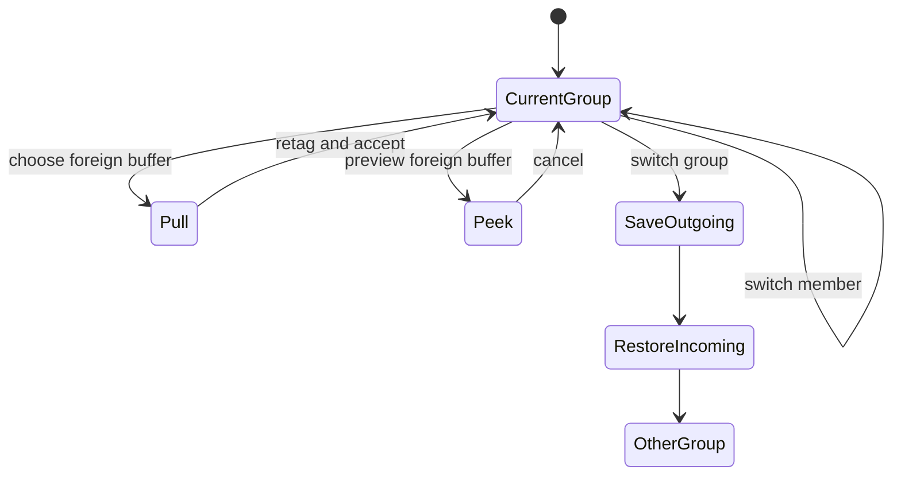

# Groups specification

## 1. Purpose

A group is one editor work context. It joins buffers, chats, a window layout, recency, metadata, and companion policy.

This document defines required behavior for the Scheme implementation and its tests. It uses **MUST**, **SHOULD**, and **MAY** as normative terms.

Groups are not security boundaries. Groups do not own files, projects, Git worktrees, frames, windows, chats, or agent permissions.

## Design Goals

A group is a fundamental unit of work. All buffers in a group are connected to each other as a shared context. Switching between buffers in a group should feel easy. Switching between groups should be easy. In general a group should open the way you left it.

One model of stumpwm that I really like is that you decide the frame and then you pull whatever you want to you. As such pull-to-group and push-to-group should be basic buffer functions.

This is an important indication of the emacs mind. Instead of imperatively switching to a buffer then changing its group membership, we declare what we want. We want to pull a buffer to this group.

Pull the context to you is a core operating principle.  

## 2. Terms

| Term | Definition |
|---|---|
| **group ID** | The immutable opaque identity of one group. |
| **group name** | The mutable user-visible label of one group. |
| **group record** | Durable state keyed by the group ID. |
| **member** | A live buffer whose buffer-local `group-id` equals the group ID. |
| **work member** | A member that is not a chat buffer. |
| **group chat** | Any chat buffer whose `group-id` equals the group ID. |
| **primary chat** | The optional chat selected for companion and ask actions. |
| **frame context** | The frame-local group ID in `current-group`. |
| **visible group** | A group with at least one member in the frame window tree. |
| **remembered layout** | The latest valid arrangement saved when a visible group is left. |
| **default layout** | A generated recovery or initial arrangement used when no valid remembered layout exists. |
| **peek** | A temporary display of foreign work that changes neither membership nor frame context. |

## 2.1 User stories

These stories describe the intended experience. Later requirements define the exact state changes.

### Discover groups and projects

- As a user, I want one view of groups and projects, so I can understand my available contexts.
- As a user, I want group rows to show purpose and recent work, so names are not my only cue.
- As a user, I want project rows to show related groups, so I can find curated workspaces.
- As a user, I want search to match groups, projects, buffers, modes, and paths.
- As a user, I want to expand a group or project without entering it.
- As a user, I want empty groups to remain visible until I remove them.

A project is discovered from the filesystem. A group is a workspace that I curate.

One group can include several projects. One project can contribute buffers to several groups.

### Stand in and move between groups

- As a user, I want the current group to be the place where I stand.
- As a user, I want ordinary buffer switching to move only among members of that group.
- As a user, I want switching groups to restore the destination as I last left it.
- As a user, I want to choose a group and then optionally choose a destination inside it.
- As a user, I do not want group switching to move the buffer from which I invoked it.
- As a user, I want the previous group and previous buffer to be fast default targets.
- As a user, I want cancellation to restore every previewed window change.
- As a user, I want one undo action to reverse an accidental context switch.

Entering a project need not create a group. Projects supply files and annotations; groups remain the frame contexts.

### Create and organize groups

- As a user, I want to create a group from my current windows.
- As a user, I want to create an empty group before I open its files.
- As a user, I want to rename a group without changing its identity or active work.
- As a user, I want to dissolve a group without killing its buffers.
- As a user, I want group names to remain unique and easy to search.
- As a user, I want groups to survive restart even when they contain no live buffers.

### Pull and push work

- As a user, I want to pull an ungrouped or foreign buffer into the group where I stand.
- As a user, I want to push one or more current members to another group.
- As a user, I want to select the work first; I do not want to visit each buffer before changing membership.
- As a user, I want pull and push to preserve files, text, modified state, point, and undo history.
- As a user, I want removing membership to preserve the buffer.
- As a user, I want membership changes to leave me in the current group.
- As a user, I want a visible pushed buffer to be replaced safely without entering its destination.

Commands and prompts MUST say **buffer** when they change membership and **file** only when they change disk state. Keybindings are mappings onto the named operations; they do not define the operations.

### Return to groups as they were left

- As a user, I want a group to reopen as I last validly left it.
- As a user, I want ordinary splits and window changes to become part of that remembered state when I leave.
- As a user, I do not want popups, peeks, or covering surfaces to overwrite remembered state.
- As a user, I want missing buffers and invalid snapshots to heal instead of blocking entry.
- As a user, I want a generated default for a new or unrecoverable group.
- As a user, I want an explicit reset to that default.
- As a user, I want layout history to remain separate for each frame.

The remembered layout is observed state, not a manually maintained canonical template. The default layout is only an initial arrangement, an explicit reset target, or a recovery fallback.

### Work with multiple chats

- As a user, I want a group to contain zero, one, or many chats.
- As a user, I want one chat to act as the default companion.
- As a user, I want to change the primary chat without changing the group.
- As a user, I want to create or close chats without affecting work membership.
- As a user, I want ask and work-chat toggle commands to use the primary chat.
- As a user, I want a clear choice when no primary chat exists.
- As a user, I want each chat to retain its own history and identity.

### Recover and stay safe

- As a user, I want groups, names, membership, chats, and layouts to survive restart.
- As a user, I want old name-based groups to migrate without duplicate workspaces.
- As a user, I want modified files protected during group kill.
- As a user, I want partial failures to identify every surviving buffer.
- As a user, I want concurrent frames to keep independent layouts and contexts.
- As a user, I want delayed agent responses to follow stable group identity.
- As a user, I want failures in one group to leave other groups unchanged.

## 2.2 Interaction model

The current group is the place where the user stands. Commands either move within that place, bring work into it, send work out of it, or move the user to another place.

[UX-LOCUS-1] The frame context MUST be the implicit destination for ordinary open, create, and pull operations.

[UX-LOCUS-2] The interface MUST NOT require visiting a buffer before changing its membership.

[UX-LOCUS-3] Projects provide sources and annotations for work. They MUST NOT become a second frame-context system.

### Command roles

| Operation | Meaning |
|---|---|
| **switch buffer** | Visit another member of the current group. |
| **switch group** | Stand in another group and restore it as last left. |
| **pull buffer** | Bring a selected buffer into the current group. |
| **push buffer** | Send a selected member to another group. |
| **peek buffer** | Temporarily display foreign work without changing membership. |

[UX-ROLE-1] Switching a buffer MUST NOT change membership.

[UX-ROLE-2] Switching a group MUST NOT move the buffer from which the command was invoked.

[UX-ROLE-3] Pull and push MUST NOT switch the frame context.

[UX-ROLE-4] Prompts MUST use the verbs **switch**, **pull**, **push**, and **peek** precisely.

### Default scope and universal prefix

An unprefixed command operates in the current group. One universal prefix exposes the context or source that the command would otherwise infer.

| Command shape | Required scope |
|---|---|
| buffer switch | Members of the current group. |
| prefixed buffer switch | All buffers, with foreign membership visible. |
| find file | Current group; a successful visit joins it. |
| prefixed find file | Choose a project or source, then open the file into the current group. |
| create chat | Current group. |
| prefixed create chat | Choose the destination group first. |
| pull buffer | Choose a source context, then buffers. |
| push buffer | Choose buffers here, then a destination group. |

[UX-PREFIX-1] One `C-u` MUST mean "make the implicit context explicit."

[UX-PREFIX-2] A prefixed command MUST retain the underlying command's verb. Prefixing find-file still finds a file; it does not create a chat or switch groups.

[UX-PREFIX-3] `C-u C-u` is reserved.

[UX-PREFIX-4] Cancelling either layer MUST leave membership, frame context, windows, layouts, and MRU unchanged.

### Pull and push

Pull expresses "bring that work here":

```text
Choose source context -> choose one or more buffers -> pull into current group
```

Push expresses "send this work there":

```text
Choose one or more current members -> choose destination group -> push
```

[UX-PULL-1] Pulling an ungrouped buffer MUST assign the current group ID.

[UX-PULL-2] Pulling a foreign member MUST replace its old group ID with the current group ID.

[UX-PULL-3] Pull MAY display the chosen buffer after success, but MUST NOT require an intermediate visit.

[UX-PUSH-1] Pushing MUST replace each selected member's group ID with the destination group ID.

[UX-PUSH-2] Pushing MUST leave the user in the source frame context.

[UX-PUSH-3] When the pushed buffer is visible, the source layout MUST choose a live replacement without entering the destination.

[UX-MOVE-1] Pull and push MUST preserve file identity, text, modified state, point, and undo history.

[UX-MOVE-2] Neither operation moves or renames a file on disk.

### Minibuffer behavior

All group-aware palettes use the existing candidate and marginalia matcher.

[UX-MINI-1] Matching MUST be case-insensitive.

[UX-MINI-2] Matching MUST include the rendered candidate and its marginalia, including group, project, mode, path, and chat title when present.

[UX-MINI-3] Ordinary typing MUST be sufficient. A special query language MUST NOT be required.

[UX-MINI-4] Candidate order SHOULD remain stable while the query changes.

[UX-MINI-5] Multi-selection MUST use the list surface's ordinary marking gesture.

[UX-MINI-6] Invalid actions MUST be absent or visibly unavailable.

### Group switching

Group switching is one operation: choose a group and stand there.

[UX-GROUP-1] The previous group SHOULD be the default candidate so the command followed by `RET` toggles contexts.

[UX-GROUP-2] Accepting a group MUST save the visible source arrangement and restore the destination arrangement.

[UX-GROUP-3] A group MUST reopen as it was last validly left.

[UX-GROUP-4] Choosing a destination within a group MAY be a second layer, but it MUST refine focus after the group has been selected; it MUST NOT redefine membership.

[UX-GROUP-5] The destination layer MUST offer the last-focused member, other recent members, chats, and group actions.

### Foreign buffers and peeking

A foreign buffer is not an ordinary member of the current switching pool.

[UX-FOREIGN-1] Selecting a foreign buffer from a broadened search MUST make the distinction explicit.

[UX-FOREIGN-2] The available actions MUST include **pull here**, **switch to its group**, and **peek** when valid.

[UX-FOREIGN-3] Peek MUST preserve both group memberships and the frame context.

[UX-FOREIGN-4] A peek is a temporary detour and MUST NOT overwrite either group's remembered layout.

### Interaction grammar

Across group-aware candidate surfaces:

| Gesture | Meaning |
|---|---|
| `RET` | Accept the highlighted operation or destination. |
| `TAB` | Descend into the highlighted context. |
| `S-TAB` | Return one layer. |
| `SPC` | Mark or unmark an actionable buffer. |
| `C-g` | Return one layer, then cancel from the first layer. |

The first `C-g` in a second layer MUST return to the unchanged first-layer query. Final cancellation MUST restore the complete pre-command state.

## 3. Data model

### 3.1 Stable identity

[G-ID-1] Group creation MUST generate one immutable opaque `group-id`.

[G-ID-2] A group ID MUST remain unchanged through rename, restart, and restore.

[G-ID-3] Membership, frame context, MRU, layouts, agent lanes, and asynchronous work MUST use the group ID.

[G-ID-4] Code MUST NOT use a group name or chat buffer name as identity.

[G-ID-5] A deleted group ID MUST NOT be reused.

A UUID is a suitable representation. Its exact representation is an implementation detail.

### 3.2 Membership

[G-MEM-1] A member MUST carry one buffer-local `group-id`.

[G-MEM-2] A buffer MUST belong to zero or one group.

[G-MEM-3] The implementation MUST derive live membership from buffer tags. It MUST NOT keep another authoritative roster.

[G-MEM-4] Killing a buffer MUST remove it from derived membership without a cleanup step.

[G-MEM-5] Every group chat MUST carry the same `group-id` as other members.

[G-MEM-6] User interfaces MUST distinguish work members, chat members, and total members.

Transient prompts and list buffers SHOULD remain ungrouped. A user MAY add other special buffers.

### 3.3 Group record

The group record is independent of every chat buffer.

| Field | Required value |
|---|---|
| `group-id` | Immutable opaque identity. |
| `group-name` | Mutable user-visible label. |
| `group-meta` | Optional one-line purpose. |
| `group-layout` | Optional opaque remembered layout, updated when the visible group is validly left. |
| `group-noise` | `off`, `quiet`, or `loud`. |
| `primary-chat-id` | Optional stable chat identity. |

[G-RECORD-1] Each existing group MUST have exactly one durable record after repair.

[G-RECORD-2] The record MUST NOT live in or depend on a chat buffer.

[G-RECORD-3] Records MAY persist in dedicated hidden state buffers or a desktop registry.

[G-RECORD-4] Record creation and lookup MUST be idempotent.

[G-RECORD-5] Killing any chat MUST leave the record and other members unchanged.

[G-RECORD-6] A group MAY contain zero, one, or many chats.

[G-RECORD-7] `primary-chat-id` MUST be absent or reference a live chat in the same group.

[G-RECORD-8] When the primary chat dies, selection MUST choose another group chat or become absent.

[G-RECORD-9] A record defines group existence even when the group has no live members.

### 3.4 Frame state

Each frame stores a group ID in `current-group`.

[G-FRAME-1] A context switch MUST set `current-group` to the entered group ID.

[G-FRAME-2] A detour through an ungrouped buffer MUST preserve `current-group`.

[G-FRAME-3] Ordinary switching MUST exclude another group's members. A deliberate peek at a foreign member MUST preserve `current-group`.

[G-FRAME-4] When no frame context exists, the current buffer's valid group ID MAY initialize it.

[G-FRAME-5] Dissolving the frame context MUST clear `current-group`.



## 4. Names

[G-NAME-1] Commands MUST trim surrounding whitespace before validation.

[G-NAME-2] Commands MUST reject an empty name without changing state.

[G-NAME-3] Name comparison MUST be exact after trimming.

[G-NAME-4] Two live group records MUST NOT share one normalized name.

[G-NAME-5] Names MAY contain spaces. Prompts and rows MUST display them without ambiguity.

[G-NAME-6] A name change MUST NOT change the group ID or any membership tag.

[G-NAME-7] A project-name collision MUST join the existing group or report a conflict.

## 5. Core operations

An error MUST leave unrelated buffers, layouts, frame state, and MRU state unchanged.

### 5.1 Ensure a group

Input: normalized `NAME`.

Success MUST create or reuse the group record. It MUST preserve metadata and existing chats. It MUST set invalid or missing noise to `quiet`.

Failure MUST report the reason and leave no partial group.

### 5.2 Pull and push

Pull and push are the two directional forms of membership change.

[G-PULL-1] Pulling an existing member of the current group MUST be a no-op.

[G-PULL-2] Pulling an ungrouped buffer MUST set its `group-id` to the frame context.

[G-PULL-3] Pulling a foreign member MUST replace its old tag with the frame context ID.

[G-PULL-4] Pull MUST resolve the destination from the invoking frame, not from the selected buffer.

[G-PUSH-1] Push MUST require an explicit destination group.

[G-PUSH-2] Pushing MUST replace the selected member's old tag with the destination group ID.

[G-PUSH-3] Push MUST preserve the invoking frame context.

[G-PUSH-4] Pull and push MUST support marked buffers as one transaction.

[G-MOVE-1] Pull and push MUST preserve text, file identity, modified state, point, and undo history.

[G-MOVE-2] Failed destination-record creation MUST leave every old membership authoritative.

[G-MOVE-3] Membership changes MUST NOT move or rename files on disk.

### 5.3 Remove

[G-REMOVE-1] Remove MUST clear only the selected buffer's `group-id` tag.

[G-REMOVE-2] Remove MUST preserve the buffer and its contents.

[G-REMOVE-3] Removing the last work member MUST preserve the group record and any chat members.

[G-REMOVE-4] Removing a chat MUST NOT remove the group record or other chats.

### 5.4 Found from current windows

`group-found-from-windows(NAME)` forms one group from visible buffers.

[G-FOUND-1] The command MUST capture the layout before it changes tags or windows.

[G-FOUND-2] It MUST exclude minibuffers and transient prompt buffers.

[G-FOUND-3] It MUST warn before moving buffers from existing groups.

[G-FOUND-4] Cancellation MUST preserve tags, layouts, frame state, and MRU state.

[G-FOUND-5] Success MUST enter the new group and save the captured layout.

### 5.5 Open a file

[G-FILE-1] A successful visit from grouped work MUST join the file to the frame context.

[G-FILE-2] A failed visit MUST NOT create a tag.

[G-FILE-3] A visit from ungrouped work MUST remain ungrouped unless the user selects a group.

[G-FILE-4] An external file rename or deletion MUST NOT remove membership.

## 6. Buffer and context switching

Buffer switching and group switching are different movements. Buffer switching moves within the current group. Group switching changes where the user stands.

### 6.1 Current-group switching

[G-SWITCH-1] The ordinary buffer switcher MUST list current-group members by default.

[G-SWITCH-2] `RET` on a current member MUST replace only the selected window's buffer.

[G-SWITCH-3] An ordinary buffer switch MUST NOT change `current-group`, membership, or another window.

[G-SWITCH-4] The buffer just left MUST be the next ordinary-switch default.

[G-SWITCH-5] The current group's last-focused member MUST update after an accepted switch.

When no frame context exists, the ordinary switcher MAY use ungrouped buffers and the current project as fallbacks. It MUST make that fallback scope visible.

### 6.2 Broadened switching

A prefixed switch MAY search all buffers, groups, projects, and chats.

| Selection | Required choices |
|---|---|
| current-group member | Switch here. |
| foreign member | Pull here, switch to its group, or peek. |
| ungrouped buffer | Pull here or peek. |
| group | Switch group. |
| project | Inspect or choose a file to pull into the current group. |

[G-BROAD-1] A foreign selection MUST NOT silently become a permanent mixed-group window.

[G-BROAD-2] The palette MUST display each candidate's group or ungrouped status.

[G-BROAD-3] Pulling from the broadened switcher MUST complete as one membership transaction.

[G-BROAD-4] Switching to the foreign buffer's group MUST save and restore layouts as one context switch.

### 6.3 Group switching

[G-CONTEXT-1] A context switch MUST save the visible outgoing group first.

[G-CONTEXT-2] It MUST set `current-group` to the destination group ID.

[G-CONTEXT-3] It MUST restore the destination as last validly left.

[G-CONTEXT-4] A requested destination member MUST have focus after restore.

[G-CONTEXT-5] One context switch MUST create one group-MRU entry and one winner-history entry.

[G-CONTEXT-6] Layout construction and healing MUST NOT create extra history entries.

### 6.4 Rows and filtering

Each buffer row shows mode, group, project, and file. Search matches case-insensitively across the candidate and all rendered marginalia.

A group-name match MUST return its group entry. A broadened search MAY also return its members. A buffer with the same name MUST remain a distinct typed candidate.

### 6.5 Preview and cancellation

[G-PREVIEW-1] Preview MAY replace the selected window's displayed buffer.

[G-PREVIEW-2] Preview MUST NOT change membership, create a group, save a snapshot, update durable MRU, or invoke an agent.

[G-PREVIEW-3] The switcher MUST capture the original tree, selected window, buffer, point, scroll, and frame context.

[G-PREVIEW-4] Cancellation MUST restore every captured value that remains valid.

[G-PREVIEW-5] If a captured buffer dies, cancellation MUST choose a live fallback.

[G-PREVIEW-6] Reentry MUST replace the earlier preview transaction rather than stack restoration records.

[G-PREVIEW-7] Previewing foreign work MUST be visibly identified as a peek.



## 7. Layouts

### 7.1 Snapshot

A snapshot contains the window tree, split ratios, displayed buffers, point, and scroll state.

[G-LAYOUT-1] Code MUST treat a snapshot as opaque outside the layout API.

[G-LAYOUT-2] A persisted snapshot MUST NOT contain live frame or window objects.

[G-LAYOUT-3] Restore MUST resolve saved buffer identities against live buffers.

### 7.2 Save rules

The implementation MUST save a group layout:

1. when the switcher opens from a visible group;
2. before a context switch leaves a visible group;
3. before a covering surface replaces a visible group pane.

[G-SAVE-1] A full-frame detour MUST NOT overwrite the saved layout.

[G-SAVE-2] A remembered frame context alone does not make a group visible.

[G-SAVE-3] One logical command MUST write at most one snapshot for one group.

### 7.3 Validation and healing

A snapshot is invalid when the layout API rejects it. It is also invalid when it contains no live destination member.

[G-HEAL-1] Restore MUST discard an invalid snapshot.

[G-HEAL-2] Restore MUST build the default layout after rejection.

[G-HEAL-3] Restore MUST save the healed layout after success.

[G-HEAL-4] Restore MUST NOT resurrect a killed buffer.

A partly valid snapshot SHOULD replace missing buffers with recent live work members. It SHOULD collapse empty windows.

### 7.4 Default layout

Apply these rules in order:

1. If no work member exists, show the primary chat full frame when it exists.
2. Select the most recent work member as primary.
3. If it is the only work member, show it full frame unless noise is `loud` and a primary chat exists.
4. With `loud`, show the primary chat in a companion column when it exists.
5. With `quiet`, keep chats available but hidden.
6. With `off`, do not add a chat.
7. If another work pane is needed, show the next recent work member.

### 7.5 Winner history

[G-WIN-1] A destructive layout command MUST record the outgoing arrangement.

[G-WIN-2] A context switch MUST create exactly one winner undo step.

[G-WIN-3] One undo after a context switch MUST restore the arrangement that the user left.

[G-WIN-4] Winner history MUST be frame-local.

The reference bindings are `C-c <left>` for undo and `C-c <right>` for redo.

## 8. Companion noise

| Value | Default-layout behavior |
|---|---|
| `off` | Do not show a chat. |
| `quiet` | Keep chats hidden and available. |
| `loud` | Show the primary chat beside work when one exists. |

[G-NOISE-1] Missing or unknown values MUST normalize to `quiet`.

[G-NOISE-2] Cycling MUST use `off -> quiet -> loud -> off`.

[G-NOISE-3] A noise change MUST NOT destroy the current manual layout.

[G-NOISE-4] The value MUST affect the next default-layout construction.

## 9. Groups board

The board is a management and relationship view, not a competing navigation system. It shows group name, work-member count, noise, recent work members, dirty state, metadata, and related projects.

| Key | Operation |
|---|---|
| `RET` | Stand in the group and restore it as last left. |
| `TAB` | Expand or collapse members and chats without entering. |
| `SPC` | Mark a compatible group or expanded buffer row. |
| action: **Pull here** | Pull marked buffer rows into the current group. |
| action: **Push to group** | Push marked current-group buffer rows to a chosen destination. |
| `d` | Generate one-line metadata. |
| `n` | Cycle noise. |
| `x` | Dissolve the group. |
| `K` | Kill the group. |
| `g` | Recompute and redraw rows. |

[G-BOARD-1] Marked actions MUST affect compatible marked rows. Otherwise they affect the row at point.

[G-BOARD-2] Refresh MUST derive groups from records and member counts from live buffers.

[G-BOARD-3] Refresh MUST discard marks for absent groups or buffers.

[G-BOARD-4] A disappearing buffer or group MUST NOT abort the refresh.

[G-BOARD-5] Expanding a group MUST NOT change the frame context, membership, layout, or durable MRU.

[G-BOARD-6] Pull and push from the board MUST obey the same transactional contracts as every other candidate surface.

[G-BOARD-7] A project relationship is annotation and a source of files; accepting a project MUST NOT silently create or enter a group.

### 9.1 Describe

[G-DESC-1] Describe MUST use current membership and existing metadata.

[G-DESC-2] A stale response MUST NOT recreate a dissolved or killed group.

[G-DESC-3] A response for a renamed group MUST use stable identity or be rejected.

[G-DESC-4] LLM failure MUST preserve previous metadata.

### 9.2 Dissolve

[G-DISSOLVE-1] Dissolve MUST clear the `group-id` tag from every live member.

[G-DISSOLVE-2] It MUST preserve text, files, modified state, points, and undo history.

[G-DISSOLVE-3] It MUST clear matching frame contexts.

[G-DISSOLVE-4] Every retained chat MUST lose its `group-id`. The group record MUST be retired.

[G-DISSOLVE-5] Repeating dissolve MUST be safe.

### 9.3 Kill

[G-KILL-1] Kill MUST use the standard buffer-kill policy.

[G-KILL-2] Kill MUST preserve modified file buffers unless standard confirmation allows data loss.

[G-KILL-3] Kill SHOULD apply standard policy to modified non-file buffers.

[G-KILL-4] Survivors MUST lose the killed `group-id` tag unless the user cancels the complete operation.

[G-KILL-5] The command MUST report each survivor and its reason.

[G-KILL-6] The command MUST NOT report full success while a member survives.

[G-KILL-7] Full success MUST retire the group record and clear matching frame contexts.
## 10. Rename

Rename changes `group-name` on one group record. The `group-id` remains unchanged.

It performs these steps:

1. Resolve the group by ID.
2. Normalize and validate the new name.
3. Reject a name used by another live record.
4. Update `group-name`.
5. Refresh name-based indexes and visible rows.

[G-RENAME-1] Rename MUST NOT change member tags, frame contexts, MRU identities, layouts, chat identities, or agent lanes.

[G-RENAME-2] Failure MUST preserve the previous name.

[G-RENAME-3] Rename MUST appear atomic to readers.

[G-RENAME-4] Rename MUST NOT rename files, projects, worktrees, chat buffers, or transcript text.

[G-RENAME-5] Running asynchronous work MUST continue to target the same group ID.

## 11. Persistence and recovery

Desktop persistence includes group records, member `group-id` tags, and independent chat identity.

Rendered rows, overlays, cached membership, and live tasks MUST NOT persist as identity state.

[G-PERSIST-1] File buffers MUST reopen from disk. Disk content remains authoritative.

[G-PERSIST-2] Supported non-file buffers MUST restore text, point, and identity locals.

[G-PERSIST-3] Chat reset MUST preserve its chat identity and `group-id`.

[G-PERSIST-4] Restart MUST NOT duplicate records, chats, MRU entries, or agent lanes.

[G-PERSIST-5] One malformed group MUST NOT abort the desktop restore.

[G-PERSIST-6] Queries MUST tolerate member tags before records and records before members.

Restore MUST perform deterministic repair:

- normalize invalid noise to `quiet`;
- select one record for each duplicated group ID;
- avoid merging ambiguous layouts;
- retain valid membership when record state is missing;
- quarantine or report invalid names;
- reject malformed snapshots;
- tolerate missing or inaccessible files;
- rebuild board and switcher state.

An orphaned group record MAY remain until cleanup. Cleanup MUST report why it discards durable state.
### 11.1 Migration from name identity

Older desktop data MAY store a group name in `group` instead of a stable ID.

[G-MIGRATE-1] Restore MUST generate one group ID for each distinct valid legacy name.

[G-MIGRATE-2] Restore MUST create one group record for that ID and name.

[G-MIGRATE-3] Restore MUST replace all matching legacy member tags with the generated ID.

[G-MIGRATE-4] Restore MUST migrate layout, metadata, and noise into the record.

[G-MIGRATE-5] Restore MUST keep every legacy chat as an independent chat member.

[G-MIGRATE-6] Restore MAY select the most recent legacy chat as `primary-chat-id`.

[G-MIGRATE-7] Migration MUST be idempotent across interrupted restores.


## 12. Multiple frames and concurrency

[G-CONCUR-1] Each frame MUST keep its own context, tree, winner history, and preview transaction.

[G-CONCUR-2] Two frames MAY enter the same group.

[G-CONCUR-3] Concurrent snapshot saves use last-completed-write wins.

[G-CONCUR-4] A snapshot MUST contain no live object from its source frame.

[G-CONCUR-5] Concurrent creation of one normalized name MUST produce one group ID and one record.

[G-CONCUR-6] The losing creator MAY join the winner. Otherwise it MUST report a conflict.

[G-CONCUR-7] Board, restore, and switcher code MUST tolerate buffers dying between discovery and action.

## 13. Chat, agents, and background work

[G-CHAT-1] Creating a chat in a group MUST assign a stable chat ID and the group's `group-id`.

[G-CHAT-2] Chat creation MUST NOT replace or delete an existing group chat.

[G-CHAT-3] `group-chat` MUST select the primary chat when one exists.

[G-CHAT-4] When no primary chat exists, `group-chat` MUST select another group chat or create one.

[G-CHAT-5] The user MUST be able to change the primary chat without changing group identity.

[G-CHAT-6] Killing a non-primary chat MUST NOT change `primary-chat-id`.

[G-CHAT-7] A chat buffer name and title are presentation only.


[G-AGENT-1] Each group chat prompt MUST derive current membership before each turn.

[G-AGENT-2] The prompt MUST omit killed buffers.

[G-AGENT-3] The prompt SHOULD include paths, projects, mode instructions, and metadata.

[G-AGENT-4] Moving a buffer MUST affect future group work only.

[G-AGENT-5] Running work MUST finish in its original lane or receive explicit cancellation.

[G-AGENT-6] Rename, dissolve, and kill MUST notify attached group work.

[G-AGENT-7] Group membership MUST NOT grant tool permission.

[G-AGENT-8] Chat or agent creation failure MUST NOT retag unrelated buffers.

## 14. Failure and edge-case matrix

| Case | Required result |
|---|---|
| Empty or whitespace name | Reject with no state change. |
| Duplicate name | Join explicitly or report a conflict. |
| Group name equals a buffer name | Keep separate group and buffer entries. |
| Any chat dies while work survives | Keep the record, membership, and other chats. |
| Last work member leaves | Keep the record and chats. Show the primary chat when available. |
| Last member leaves | Keep the record until explicit dissolve, kill, or cleanup. |
| Current buffer is ungrouped | Preserve the frame context. |
| Plain switch shows another group | Preserve the frame context and layout. |
| Context has no visible member | Do not save its remembered layout. |
| Snapshot has some dead buffers | Replace or collapse invalid windows. |
| Snapshot has no live member | Build and save the default layout. |
| Snapshot has different dimensions | Restore best effort, then save healed state. |
| Preview candidate dies | Cancel to a live fallback. |
| Switcher is reentered | Replace the first preview transaction safely. |
| Project file has no group | Offer project group creation. |
| Non-project buffer has no group | Use a plain switch and explain the result. |
| File is deleted externally | Keep membership and report file errors separately. |
| Buffer dies during board refresh | Recompute and continue. |
| Modified file during dissolve | Clear only the tag. |
| Modified file during kill | Preserve unless standard confirmation allows loss. |
| Kill leaves survivors | Report partial completion and reasons. |
| Rename fails | Preserve the old name and stable group ID. |
| Rename occurs during an agent turn | Keep the turn on stable identity. |
| Description returns after dissolve | Discard the response. |
| Restore stops halfway | Derive membership and repair on the next restore. |
| Two frames save one group | Last completed valid snapshot wins. |
| Two creators race | Produce one group ID and one record. |
| Unknown noise | Normalize to `quiet`. |
| Malformed layout | Reject it without aborting group entry. |
| Group spans projects | Preserve the group. Project remains an annotation. |
| User cancels founding | Preserve tags, windows, MRU, and context. |

## 15. Invariants

1. Every live buffer has zero or one `group-id` tag.
2. Every reported member is live and has the matching tag.
3. Every repaired group ID has exactly one durable group record.
4. A plain buffer switch changes one displayed buffer only.
5. A context switch saves the visible source and restores or heals the destination.
6. A detour cannot overwrite a saved layout.
7. One context switch creates one group MRU entry and one winner undo step.
8. No group command silently discards modified file content.
9. Join, ensure-record, refresh, remove, dissolve, and restore tolerate repetition.
10. Membership lists, counts, and prompts derive from live buffers. Group rows derive from records.
11. Identity survives restart. Runtime and rendered state rebuild after restart.
12. Failure in one group does not corrupt another group.

## 16. Acceptance tests

Each requirement ID MUST map to a focused test or an explicit integration-test group.

Tests MUST inspect state, not only rendered windows. Relevant assertions include:

- buffer-local tags;
- group ID, record fields, and member tags;
- frame context;
- selected window and buffer;
- tree, point, and scroll;
- buffer and group MRU order;
- winner undo and redo state;
- modified flags and buffer text;
- desktop persistence payload;
- agent lane identity;
- board rows and marks.

The minimum scenario set is:

1. Found, pull, repeat pull, push, remove, and repeat remove.
2. Ordinary current-group buffer switching and `C-u` broadened switching.
3. Foreign-buffer choices: pull here, switch to its group, peek, and cancel.
4. Group selection followed by immediate entry and by a second-layer destination.
5. Project selection as a file source without creating a competing frame context.
6. Accept and cancel after several previews.
7. Cancel after the preview candidate dies.
8. Valid, partial, stale, malformed, and cross-size layout restore.
9. Automatic save-on-leave, popup exclusion, peek exclusion, and explicit reset to default.
10. Scratch, help, popup, and full-frame detours.
11. All noise values, invalid noise, cycling, and restart.
12. Dissolve with clean, modified file, and modified non-file buffers.
13. Kill with success, cancellation, and survivors.
14. Rename success, collision, injected failure, and active work.
15. Missing, duplicate, and orphan records, plus interrupted restore.
16. Two-frame entry, concurrent saves, and duplicate creation.
17. Board expansion and refresh while buffers and groups disappear.
18. Pull and push of marked board or palette rows as a single transaction.
19. Describe success, failure, rename, and stale response.
20. Restart with files, non-file buffers, chats, layouts, and MRU.
21. Zero, one, and many chats, including primary-chat reassignment.
22. Legacy name-based migration, including interrupted migration.
23. Case-insensitive matching across candidate text and rendered marginalia.
24. `C-u` cancellation at either layer with no membership, layout, MRU, or frame-context change.

Key-driven tests MUST dispatch the real key sequence through the editor key dispatcher.
## 17. Reference command surface

The interaction model has four primary verbs. Bindings expose those verbs; they do not redefine them.

| Intent | Reference binding | Operation |
|---|---|---|
| Move within the current group | `C-x b` | List current-group buffers and chats, using the existing case-insensitive candidate-plus-marginalia matcher. |
| Broaden the current buffer search | `C-u C-x b` | Include foreign and ungrouped buffers; accepting one requires **pull here**, **switch to its group**, or **peek**. |
| Stand in another group | `C-x g` | Choose a group, then optionally choose a destination within it. Immediate acceptance restores the group as last left. |
| Navigate a project as a source | `C-x p p` | Choose a project, then a file or open buffer; visiting it from grouped work pulls it into the current group. |
| Find a file here | `C-x C-f` | Visit a file and join it to the current group after a successful open. |
| Choose a source, then find a file here | `C-u C-x C-f` | Choose a project or other file source, then open the result into the current group. |
| Pull selected work here | command action: **Pull buffer here** | Choose a source and one or more buffers without visiting them first. |
| Push selected work away | command action: **Push buffer to group** | Choose one or more current members, then the destination group. |
| Toggle work and companion | `C-c w` | Toggle between grouped work and the primary chat. |
| Ask the group companion | `C-c q` | Ask the primary chat without leaving the work buffer. |
| Walk layout history | `C-c <left>` / `C-c <right>` | Undo or redo frame-local layout changes. |

[UX-KEY-1] `C-x b` MUST remain the fast path for movement inside the current group. It MUST NOT become an everything palette in its unprefixed form.

[UX-KEY-2] `C-u` MUST broaden or expose the implicit context while preserving the command's verb.

[UX-KEY-3] `C-x g` MUST mean group navigation: choose the place where the user will stand. It MUST NOT change the invoking buffer's membership.

[UX-KEY-4] Pull and push MUST be available as actions on buffer candidates and marked buffers in every applicable list surface.

[UX-KEY-5] No binding named only "group" may silently combine navigation and membership mutation.

[UX-KEY-6] `C-c g` is intentionally not assigned a normative meaning by this specification until the existing binding is audited and usability-tested. If retained, its prompt and documentation MUST name its exact verb and scope; "group command" is insufficient.

[UX-KEY-7] Dedicated shortcuts such as a groups board binding MAY exist, but the complete workflow MUST remain discoverable from the primary switch, group-navigation, and candidate-action surfaces.

Expected operations include `group-switch`, `group-pull-buffer`, `group-push-buffer`, `group-peek-buffer`, `group-remove-buffer`, `group-chat`, `group-describe`, `group-noise-cycle`, `group-dissolve`, `group-kill`, and `group-rename`.

Names and bindings MAY change after usability testing. The verbs, scopes, cancellation behavior, and observable state transitions are normative.
## 18. Presentation

The switcher uses the shared centered candidate palette. Plain line input remains in the bottom bar.

Presentation MUST NOT change switching semantics, transaction boundaries, or cancellation behavior. Command completion matches command names. Intent search MAY also match command documentation and task recipes.

## 19. Literate Scheme example

This block demonstrates Morg tangling. Run `C-c C-x` to write the Scheme source beside this specification.

```scheme :tangle examples/group-noise.scm
(define (group-noise-next noise)
  (cond ((equal? noise (quote off)) (quote quiet))
        ((equal? noise (quote quiet)) (quote loud))
        (else (quote off))))
```
