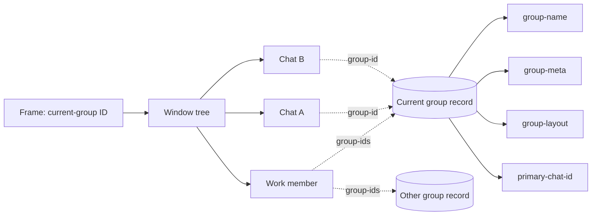
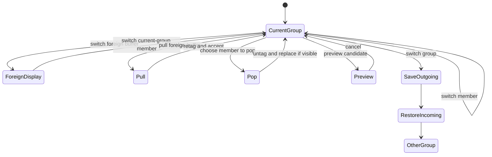

# Groups specification


## 1. Purpose
Being able to quickly load and unload context is core to the power user experience. For this we have created Groups. Working inside a group is highly optimised for everyone - humans and agents.

With 100s of buffers open, it is imperative to quickly switch only within buffers in a group. Group membership itself changes rapidly.

If we don't have an easy way to start a new group then groups get dirty. some sort of file-new-group command? another thing we find ourselves needing again and again is 'move visible buffers to this group'. group-found-from-visible? found is the wrong term. group is created if not found.

TODO check if we're using the same exact match required semantics as vertico/corfu?

## What they are
A group is one editor work context. It joins buffers, chats, a window layout, recency, metadata, and companion policy.

This document defines required behavior for the Scheme implementation and its tests. It uses **MUST**, **SHOULD**, and **MAY** as normative terms.

Groups are not security boundaries. Groups do not own files, projects, Git worktrees, frames, windows, chats, or agent permissions.

## Design Goals

A group is a fundamental unit of work and a curated membership set. It is also the user's receiving context: entering a group changes where the user stands, while pull, push, and pop change membership without changing where the user stands. All buffers in a group are available as shared context. Switching within a group and switching between groups should both feel easy. In general, a group should restore the last valid homogeneous layout in which it was visible.

### pull
One model of stumpwm that I really like is that you decide the frame and then pull whatever you want to you. As such, pull-to-group and push-to-group should be basic buffer operations. They should remain explicit, cancellable, repeatable, and safe with modified buffers.

This is an important indication of the emacs mind. Instead of imperatively switching to a buffer then changing its group membership, we declare what we want. We want to pull a buffer to this group.

Pull the context to you is a core operating principle.  

### push

But push is indispensable as well. From a buffer, we may want to create a new group containing it, create a group from all visible buffers, push a buffer to another group, or add a buffer to another group. Creating or adding membership preserves existing memberships; moving work is a separate explicit operation that adds the destination membership and removes a named source membership.

# pop
Remove the current group's membership from a buffer while preserving the buffer and every other membership. Pop is not a file operation and does not imply a context switch.

Question: did i miss anything?

## 2. Terms

| Term | Definition |
|---|---|
| **group ID** | The immutable opaque identity of one group. |
| **group name** | The mutable user-visible label of one group. |
| **group record** | Durable state keyed by the group ID. |
| **work member** | A live non-chat buffer whose buffer-local `group-ids` set contains the group ID. |
| **group chat** | A chat buffer whose single buffer-local `group-id` equals the group ID. |
| **member** | A work member or group chat. |
| **primary chat** | The optional chat selected for companion and ask actions. |
| **frame context** | The frame-local group ID in `current-group`; the group where the user stands. |
| **foreign buffer** | A live buffer that is not a member of the frame context, even if it belongs to other groups. |
| **visible group** | A group whose members are the only work buffers displayed in the frame window tree. |
| **remembered layout** | The latest valid snapshot recorded while all visible buffers belong to one group; this is what group entry restores. |
| **default layout** | A generated recovery or initial arrangement used when no valid remembered layout exists. |
| **pull** | Add a selected work buffer to the frame context. |
| **push** | Add selected work to any chosen existing group or to a newly created group. |
| **pop** | Remove a selected work buffer from the frame context without killing it or changing other memberships. |

## 2.1 User stories

These stories describe the intended experience from the group where the user is working. The current group is where the user stands; other groups and their buffers are sources from which work is pulled.

### Discover buffers to pull

- As a user working in a group, I want the pull command to show all live work buffers directly, including current-group, foreign, and ungrouped buffers.
- As a user working in a group, I want each buffer to show its groups, project, mode, and path, so I can recognize the work I may pull.
- As a user working in a group, I want search to match buffer name and all rendered group, project, mode, and path annotations.
- As a user working in a group, I want to select or mark buffers without first choosing or entering a source context.

The pull palette's candidate set is all live work buffers. Groups and projects annotate those candidates; neither is a first-layer source chooser in the pull UI.

One group can include several projects. One project can contribute buffers to several groups.

### Stand in the receiving group

- As a user working in a group, I want the current group to be the stable receiving context for every pull.
- As a user working in a group, I want ordinary buffer switching to move only among buffers already available in the receiving group.
- As a user working in a group, I want switching groups to restore the destination as I last left it.
- As a user working in a group, I want to inspect another group and select buffers from it without switching into it.
- As a user working in a group, I want switching groups to be an explicit change of where I stand, distinct from pulling buffers.
- As a user working in a group, I want the previous group and previous buffer to be fast default targets.
- As a user working in a group, I want cancellation to restore every previewed window change.
- As a user working in a group, I want one undo action to reverse an accidental context switch.

Entering a project need not create a group. Projects supply files and annotations; groups remain the frame contexts.

### Create receiving contexts

- As a user working in a group, I want to create and enter an empty group, so I can begin with a clean receiving context.
- As a user working in a buffer, I want to create a group around that buffer, so starting focused work is one action.
- As a user working in several windows, I want to create a group from the visible work buffers and layout, so the context in front of me becomes reusable.
- As a user creating from existing work, I want old memberships preserved unless I explicitly pop them, so shared buffers remain shared.
- As a user working in a group, I want to rename a group without changing its identity or active work.
- As a user working in a group, I want to dissolve a group without killing its buffers.
- As a user working in a group, I want group names to remain unique and easy to search.
- As a user working in a group, I want groups to survive restart even when they contain no live buffers.

### Pull, push, and pop buffers

- As a user working in a group, I want to choose from all live work buffers and pull selected buffers into the group where I stand.
- As a user working in a group, I want to push the current buffer or marked buffers to any existing group, or create a new destination group, without leaving this group.
- As a user working in a group, I want to pop a buffer from this group without killing it or removing its other memberships.
- As a user working in a group, I want pull, push, and pop to be separate explicit choices.
- As a user working in a group, I want to select buffers before changing membership; I do not want to visit each buffer first.
- As a user working in a group, I want every membership change to preserve files, text, modified state, point, and undo history.
- As a user working in a group, I want a pulled or pushed buffer to remain in its existing groups unless I explicitly pop it there.
- As a user working in a group, I want every pull, push, and pop to leave me in the group where I stand.
- As a user working in a group, I want visible popped buffers replaced safely without switching groups.

Commands and prompts MUST say **buffer** when they change membership and **file** only when they change disk state. Keybindings are mappings onto the named operations; they do not define the operations.

### Preserve the receiving context

- As a user working in a group, I want a group to reopen as I last validly left it.
- As a user working in a group, I want ordinary splits, window changes, and buffer switches to update the remembered snapshot whenever all visible work buffers belong to this group.
- As a user working in a group, I do not want source browsing, previews, popups, or covering surfaces to overwrite remembered state.
- As a user working in a group, I want missing buffers and invalid snapshots to heal instead of blocking entry.
- As a user working in a group, I want a generated default for a new or unrecoverable group.
- As a user working in a group, I want an explicit reset to that default.
- As a user working in a group, I want layout history to remain separate for each frame.

The remembered layout is observed state: whenever all visible work buffers belong to one group, that group's snapshot is updated, and that snapshot is what group entry restores. Mixed-group displays, source browsing, previews, popups, and covering surfaces do not update it. The default layout is only an initial arrangement, an explicit reset target, or a recovery fallback.

### Pull conversational context together

- As a user working in a group, I want a group to contain zero, one, or many chats alongside the buffers gathered there.
- As a user working in a group, I want one chat to act as the default companion.
- As a user working in a group, I want to change the primary chat without changing the group.
- As a user working in a group, I want to create or close chats without affecting work membership.
- As a user working in a group, I want ask and work-chat toggle commands to use the primary chat.
- As a user working in a group, I want a clear choice when no primary chat exists.
- As a user working in a group, I want each chat to retain its own history and identity.

### Change context safely and recoverably

- As a user working in a group, I want groups, names, membership, chats, and layouts to survive restart, so sources and receiving contexts remain available.
- As a user working in a group, I want old name-based groups to migrate without duplicate workspaces or ambiguous sources.
- As a user working in a group, I want modified files protected during group kill.
- As a user working in a group, I want partial pull, push, or pop failures to identify which buffers changed and which did not.
- As a user working in a group, I want concurrent frames to keep independent layouts and receiving contexts.
- As a user working in a group, I want delayed agent responses to follow stable group identity.
- As a user working in a group, I want failures in one group to leave every other group unchanged.

## 2.2 Interaction model

The current group is the place where the user stands. Commands move within that place, pull work into it, push work to another place, pop work out of it, create a new place, or switch where the user stands.

[UX-LOCUS-1] The frame context MUST be the implicit destination for ordinary open, create, and pull operations.

[UX-LOCUS-2] The interface MUST NOT require visiting a buffer before changing its membership.

[UX-LOCUS-3] Projects provide sources and annotations for work. They MUST NOT become a second frame-context system.

[UX-LOCUS-4] Ordinary buffer switching MUST remain restricted to the current group, regardless of how many foreign buffers are live.

### Command roles

| Operation | Meaning |
|---|---|
| `group-switch-to-buffer` | Visit another member of the current group. |
| `group-switch` | Stand in another group and restore it as last left. |
| `group-pull-buffer` | Bring a selected buffer into the current group. |
| `group-push-buffer` | Add selected work to any existing group or a newly created group without removing current memberships. |
| `group-pop` | Remove one work buffer, or marked Ibuffer work buffers, from the current group without killing them. |
| `group-new` | Create and enter an empty group. |
| `group-new-from-buffer` | Create and enter a group seeded from the current work buffer. |
| `group-new-from-visible` | Create and enter a group seeded from visible work buffers. |
| `group-chat` | Select or create the current group's primary chat. |

[UX-ROLE-1] Switching a buffer MUST NOT change membership.

[UX-ROLE-2] Switching a group MUST NOT move the buffer from which the command was invoked.

[UX-ROLE-3] Pull, push, and pop MUST NOT switch the frame context.

[UX-ROLE-4] Prompts MUST use the verbs **switch**, **pull**, **push**, **pop**, and **new** precisely.

[UX-ROLE-5] Pop MUST mean removal from a group, never killing the buffer or changing its file.

### Default scope and universal prefix

An unprefixed command operates in the current group. One universal prefix exposes the context or source that the command would otherwise infer.

| Command shape | Required scope |
|---|---|
| `group-switch-to-buffer` | Members of the current group. |
| `C-u group-switch-to-buffer` | All buffers, with foreign membership visible. |
| find file | Current group; a successful visit joins it. |
| prefixed find file | Choose a project or source, then open the file into the current group. |
| `group-chat` | Select or create a chat in the current group. |
| `C-u group-chat` | Choose the destination group first. |
| `group-pull-buffer` | Choose from all live work buffers. |
| `group-push-buffer` | Choose buffers here, then any existing group or **New group**. |
| `group-pop` | Pop one buffer, or compatible marked buffers when invoked from Ibuffer. |
| `group-new` | Choose empty, current buffer, or visible buffers as the seed. |

[UX-PREFIX-1] One `C-u` MUST mean "make the implicit context explicit."

[UX-PREFIX-2] A prefixed command MUST retain the underlying command's verb. Prefixing find-file still finds a file; it does not create a chat or switch groups.

[UX-PREFIX-3] `C-u C-u` is reserved.

[UX-PREFIX-4] Cancelling either layer MUST leave membership, frame context, windows, layouts, and MRU unchanged.

### Pull, push, pop, and move

Pull expresses "bring that work here":

```text
Choose one or more buffers from all live work buffers -> add to current group
```

Push expresses "make this work available there":

```text
Choose one or more current work members -> choose any existing group or New group -> add there
```

Pop expresses "quit that work from here":

```text
Choose one or more current work members -> remove current group membership
```

Pull and push add membership and never remove an existing membership. Pop removes exactly one membership and never kills a buffer. Move is merely the explicit compound operation **push there, then pop here**.

[UX-PULL-1] The pull palette MUST list all live work buffers directly; it MUST NOT require choosing a source group or project first.

[UX-PULL-2] Pulling an ungrouped work buffer MUST add the current group ID to its `group-ids` set.

[UX-PULL-3] Pulling a work buffer from another group MUST add the current group ID without removing any existing group ID.

[UX-PULL-4] Pull MAY display the chosen buffer after success, but MUST NOT require an intermediate visit.

[UX-PUSH-1] The push destination palette MUST list every existing group and a **New group** choice.

[UX-PUSH-2] Pushing MUST add the destination group ID to each selected work buffer without removing its current memberships.

[UX-PUSH-3] Choosing **New group** MUST create the destination and add the selected buffers without entering it.

[UX-PUSH-4] Pushing MUST leave the user in the source frame context.

[UX-PUSH-5] Push MUST NOT remove or replace a visible source buffer merely because it was added elsewhere.

[UX-POP-1] Popping MUST remove only the current group ID from each selected work buffer.

[UX-POP-2] Popping MUST leave the user in the current frame context and preserve every other membership.

[UX-POP-3] A visible popped buffer MUST be replaced safely by current-group work, a group chat, or a neutral fallback.

[UX-MOVE-1] Move MUST name both the destination group to add and the source group to remove, and MUST complete the push before the pop.

[UX-MOVE-2] Pull, push, pop, and move MUST preserve file identity, text, modified state, point, and undo history.

[UX-MOVE-3] None of these operations moves or renames a file on disk.

[UX-MOVE-4] Chats MUST NOT be pulled, pushed, popped, or moved as shared work buffers; chat ownership remains single-group.

### Group creation

Groups must be cheap to start so they do not accumulate unrelated work.

[UX-NEW-1] The user MUST be able to create and enter an empty group.

[UX-NEW-2] The user MUST be able to create and enter a group seeded with the current work buffer.

[UX-NEW-3] The user MUST be able to create and enter a group seeded with all visible work buffers and the current layout.

[UX-NEW-4] Seeding a group MUST add membership without silently removing existing memberships.

[UX-NEW-5] Moving seeded buffers out of an old group MUST be an explicit follow-up pop.

### Minibuffer behavior

All group-aware palettes use the existing candidate and marginalia matcher.

[UX-MINI-1] Matching MUST be case-insensitive.

[UX-MINI-2] Matching MUST include the rendered candidate and its marginalia, including group, project, mode, path, and chat title when present.

[UX-MINI-3] Ordinary typing MUST be sufficient. A special query language MUST NOT be required.

[UX-MINI-4] Candidate order SHOULD remain stable while the query changes.

[UX-MINI-5] Multi-selection MUST use the list surface's ordinary marking gesture.

[UX-MINI-6] Invalid actions MUST be absent or visibly unavailable.

### Group switching

Group switching is one operation: choose a group and stand there.

[UX-GROUP-1] The previous group SHOULD be the default candidate so the command followed by `RET` toggles contexts.

[UX-GROUP-2] Accepting a group MUST save the visible source arrangement and restore the destination arrangement.

[UX-GROUP-3] A group MUST reopen as it was last validly left.

[UX-GROUP-4] Choosing a destination within a group MAY be a second layer, but it MUST refine focus after the group has been selected; it MUST NOT redefine membership.

[UX-GROUP-5] The destination layer MUST offer the last-focused member, other recent members, chats, and group actions.

### Foreign buffers

A foreign buffer is not an ordinary member of the current switching pool.

[UX-FOREIGN-1] A broadened search MUST make foreign and ungrouped status explicit.

[UX-FOREIGN-2] Accepting a foreign or ungrouped buffer MUST switch the selected window to that buffer without changing any membership or the frame context.

[UX-FOREIGN-3] **Pull here** MUST remain an explicit, separate action when the buffer can join the current group.

[UX-FOREIGN-4] An accepted foreign-buffer switch is ordinary displayed state; snapshot updates MUST follow the same visible-group rules as any other buffer switch.

### Interaction grammar

Across group-aware candidate surfaces:

| Gesture | Meaning |
|---|---|
| `RET` | Accept the highlighted operation or destination. |
| `TAB` | Descend into the highlighted context. |
| `S-TAB` | Return one layer. |
| `SPC` | Mark or unmark an actionable buffer. |
| `C-g` | Return one layer, then cancel from the first layer. |

The first `C-g` in a second layer MUST return to the unchanged first-layer query. Final cancellation MUST restore the complete pre-command state.

## 3. Data model

### 3.1 Stable identity

[G-ID-1] Group creation MUST generate one immutable opaque `group-id`.

[G-ID-2] A group ID MUST remain unchanged through rename, restart, and restore.

[G-ID-3] Membership, frame context, MRU, layouts, agent lanes, and asynchronous work MUST use the group ID.

[G-ID-4] Code MUST NOT use a group name or chat buffer name as identity.

[G-ID-5] A deleted group ID MUST NOT be reused.

A UUID is a suitable representation. Its exact representation is an implementation detail.

### 3.2 Membership

Work-buffer membership and chat ownership use different cardinalities.

[G-MEM-1] A work buffer MUST carry a buffer-local set of group IDs named `group-ids`.

[G-MEM-2] A work buffer MUST belong to zero, one, or many groups.

[G-MEM-3] The implementation MUST derive live work membership from `group-ids`. It MUST NOT keep another authoritative roster.

[G-MEM-4] Killing a work buffer MUST remove it from every group's derived membership without a cleanup step.

[G-MEM-5] A chat MUST carry exactly one buffer-local `group-id` and MUST belong to at most one group.

[G-MEM-6] User interfaces MUST distinguish work members, chat members, and total members.

[G-MEM-7] Membership sets MUST contain unique valid group IDs; adding an existing membership and removing an absent membership MUST be no-ops.

[G-MEM-8] A successful pull, push, or pop MUST be visible to group switching, buffer switching, boards, and agent context on their next read; stale membership caches MUST be invalidated.

Transient prompts and list buffers SHOULD remain ungrouped. A user MAY add other non-chat special buffers as work members.

### 3.3 Group record

The group record is independent of every chat buffer.

| Field | Required value |
|---|---|
| `group-id` | Immutable opaque identity. |
| `group-name` | Mutable user-visible label. |
| `group-meta` | Optional one-line purpose. |
| `group-layout` | Optional opaque remembered layout, updated when the visible group is validly left. |
| `group-noise` | `off`, `quiet`, or `loud`. |
| `primary-chat-id` | Optional stable chat identity. |

[G-RECORD-1] Each existing group MUST have exactly one durable record after repair.

[G-RECORD-2] The record MUST NOT live in or depend on a chat buffer.

[G-RECORD-3] Records MAY persist in dedicated hidden state buffers or a desktop registry.

[G-RECORD-4] Record creation and lookup MUST be idempotent.

[G-RECORD-5] Killing any chat MUST leave the record and other members unchanged.

[G-RECORD-6] A group MAY contain zero, one, or many chats.

[G-RECORD-7] `primary-chat-id` MUST be absent or reference a live chat in the same group.

[G-RECORD-8] When the primary chat dies, selection MUST choose another group chat or become absent.

[G-RECORD-9] A record defines group existence even when the group has no live members.

### 3.4 Frame state

Each frame stores a group ID in `current-group`.

[G-FRAME-1] A context switch MUST set `current-group` to the entered group ID.

[G-FRAME-2] A detour through an ungrouped buffer MUST preserve `current-group`.

[G-FRAME-3] Ordinary switching MUST include buffers whose membership contains the frame context and exclude buffers that do not. A broadened switch to a foreign or ungrouped buffer MUST preserve `current-group` and every membership.

[G-FRAME-4] When no frame context exists and the current buffer has exactly one valid membership, that group ID MAY initialize it.

[G-FRAME-5] When the current buffer has several memberships, initialization MUST require an explicit group choice.

[G-FRAME-6] Dissolving the frame context MUST clear `current-group`.



## 4. Names

[G-NAME-1] Commands MUST trim surrounding whitespace before validation.

[G-NAME-2] Commands MUST reject an empty name without changing state.

[G-NAME-3] Name comparison MUST be exact after trimming.

[G-NAME-4] Two live group records MUST NOT share one normalized name.

[G-NAME-5] Names MAY contain spaces. Prompts and rows MUST display them without ambiguity.

[G-NAME-6] A name change MUST NOT change the group ID, any work-membership set, or any chat-owner tag.

[G-NAME-7] A project-name collision MUST join the existing group or report a conflict.

## 5. Core operations

An error MUST leave unrelated buffers, layouts, frame state, and MRU state unchanged.

### 5.1 Ensure a group

Input: normalized `NAME`.

Success MUST create or reuse the group record. It MUST preserve metadata and existing chats. It MUST set invalid or missing noise to `quiet`.

Failure MUST report the reason and leave no partial group.

### 5.2 Pull, push, and pop

Pull, push, and pop are the primitive work-membership operations.

- Pull means "bring that buffer into the group where I stand."
- Push means "make this buffer available in any chosen existing group or a newly created group."
- Pop means "quit this buffer from the group where I stand." It is the conceptual push to no group.

[G-PULL-1] Pull MUST enumerate all live work buffers directly, including current-group, foreign, and ungrouped buffers.

[G-PULL-2] Pulling a work member already in the current group MUST be a no-op.

[G-PULL-3] Pulling an ungrouped work buffer MUST add the frame context ID to its `group-ids` set.

[G-PULL-4] Pulling a work buffer from another group MUST add the frame context ID without removing existing memberships.

[G-PULL-5] Pull MUST resolve the destination from the invoking frame, not from the selected buffer.

[G-PUSH-1] Push MUST present every existing group and a **New group** choice as possible destinations.

[G-PUSH-2] Choosing **New group** MUST create a destination record without entering it, then add the selected buffers only after creation succeeds.

[G-PUSH-3] Pushing MUST add the destination group ID to each selected work buffer's `group-ids` set without removing existing memberships.

[G-PUSH-4] Push MUST preserve the invoking frame context and every source membership.

[G-POP-1] Pop MUST remove only the invoking frame's group ID from each selected work buffer's `group-ids` set.

[G-POP-2] Pop MUST preserve the buffer, its contents, and every other group membership.

[G-POP-3] Popping an absent membership MUST be a no-op.

[G-POP-4] Popping the last work member MUST preserve the group record and any chat members.

[G-POP-5] If a popped buffer is visible in the current group, the command MUST replace it safely with another current-group member, the primary chat, or a neutral fallback. It MUST NOT switch the frame context.

[G-POP-6] Outside Ibuffer, `group-pop` MUST operate on exactly one explicitly supplied buffer, defaulting to the current buffer.

[G-POP-7] In Ibuffer, `group-pop` MUST operate on all compatible marked buffers when marks exist; otherwise it MUST operate on the buffer at point.

[G-MEMOP-1] Pull and push MUST support marked work buffers as one transaction. `group-pop` MUST treat marked Ibuffer work buffers as one transaction.

[G-MEMOP-2] Pull, push, and pop MUST preserve text, file identity, modified state, point, and undo history.

[G-MEMOP-3] Membership operations MUST NOT move or rename files on disk.

[G-MEMOP-4] These operations MUST reject chat buffers and direct the user to chat-specific actions.

Removing a chat from its owning group is a chat-specific operation: it clears only the chat's single `group-id` and does not affect the record or other chats.

### 5.3 Move as composition

Move is not a fourth primitive. It is an explicit push followed by a pop.

[G-MOVE-1] A move MUST name both the destination group to push to and the source group to pop from.

[G-MOVE-2] A move MUST add every selected work buffer to the destination before removing the named source membership.

[G-MOVE-3] If destination creation or any push fails, no source membership may be popped.

[G-MOVE-4] A move MUST obey the preservation and visible-buffer rules of its component push and pop operations.

### 5.4 Create a group

Group creation has three explicit entry points:

- `group-new(NAME)` creates and enters an empty receiving context;
- `group-new-from-buffer(NAME, BUFFER)` creates and enters a group containing one work buffer;
- `group-new-from-visible(NAME)` creates and enters a group containing the visible work buffers and their captured layout.

"Create" or "new" is the user-facing verb. Implementations MUST NOT expose "found" as the creation verb.

[G-NEW-1] Every creation path MUST create or explicitly reuse one group record before changing membership.

[G-NEW-2] Creating from a buffer MUST add the new group ID without removing any existing membership.

[G-NEW-3] Creating from visible buffers MUST capture the layout before changing membership, and MUST exclude minibuffers, transient prompt buffers, and chats owned by another group.

[G-NEW-4] Creating from visible buffers MUST add the new group ID to each included work buffer without removing existing memberships.

[G-NEW-5] Success MUST enter the new group. Empty creation MUST build its default layout; buffer creation MUST focus that buffer; visible creation MUST restore the captured layout.

[G-NEW-6] Cancellation or failure MUST preserve memberships, chat ownership, windows, layouts, frame state, and MRU state.

[G-NEW-7] A request to move the current or visible buffers into a new group MUST be expressed as successful creation and push followed by an explicit pop from a named old group.

### 5.5 Open a file

[G-FILE-1] A successful visit from grouped work MUST pull the file buffer into the frame context.

[G-FILE-2] A failed visit MUST NOT create a membership.

[G-FILE-3] A visit from ungrouped work MUST remain ungrouped unless the user selects or creates a group.

[G-FILE-4] An external file rename or deletion MUST NOT remove membership.

## 6. Buffer and context switching

Buffer switching and group switching are different movements. Buffer switching moves within the current group. Group switching changes where the user stands.

### 6.1 Current-group switching

[G-SWITCH-1] The ordinary buffer switcher MUST list current-group members by default.

[G-SWITCH-2] `RET` on a current member MUST replace only the selected window's buffer.

[G-SWITCH-3] An ordinary buffer switch MUST NOT change `current-group`, membership, or another window.

[G-SWITCH-4] The buffer just left MUST be the next ordinary-switch default.

[G-SWITCH-5] The current group's last-focused member MUST update after an accepted switch.

[G-SWITCH-6] Candidate enumeration for ordinary switching SHOULD scale with current-group membership, not total live buffer count.

When no frame context exists, the ordinary switcher MAY use ungrouped buffers and the current project as fallbacks. It MUST make that fallback scope visible.

### 6.2 Broadened switching

A prefixed switch MAY search all buffers, groups, projects, and chats.

| Selection | Behavior |
|---|---|
| current-group member | Switch here. |
| foreign buffer | Switch here; offer pull here and switch group as separate actions. |
| ungrouped buffer | Switch here; offer pull here as a separate action. |
| group | Switch group. |
| project | Inspect or choose a file to pull into the current group. |

[G-BROAD-1] Accepting a foreign or ungrouped buffer MUST replace only the selected window's buffer and MUST NOT change membership or `current-group`.

[G-BROAD-2] The palette MUST display each candidate's group or ungrouped status.

[G-BROAD-3] Pulling from the broadened switcher MUST complete as one membership transaction.

[G-BROAD-4] When a foreign buffer belongs to several groups, switching to its group MUST require choosing one; the switch MUST save and restore layouts as one context switch.

### 6.3 Group switching

[G-CONTEXT-1] A context switch MUST save the visible outgoing group first.

[G-CONTEXT-2] It MUST set `current-group` to the destination group ID.

[G-CONTEXT-3] It MUST restore the destination as last validly left.

[G-CONTEXT-4] A requested destination member MUST have focus after restore.

[G-CONTEXT-5] One context switch MUST create one group-MRU entry and one winner-history entry.

[G-CONTEXT-6] Layout construction and healing MUST NOT create extra history entries.

### 6.4 Rows and filtering

Each buffer row shows mode, group, project, and file. Search matches case-insensitively across the candidate and all rendered marginalia.

A group-name match MUST return its group entry. A broadened search MAY also return its members. A buffer with the same name MUST remain a distinct typed candidate.

### 6.5 Preview and cancellation

[G-PREVIEW-1] Preview MAY replace the selected window's displayed buffer.

[G-PREVIEW-2] Preview MUST NOT change membership, create a group, save a snapshot, update durable MRU, or invoke an agent.

[G-PREVIEW-3] The switcher MUST capture the original tree, selected window, buffer, point, scroll, and frame context.

[G-PREVIEW-4] Cancellation MUST restore every captured value that remains valid.

[G-PREVIEW-5] If a captured buffer dies, cancellation MUST choose a live fallback.

[G-PREVIEW-6] Reentry MUST replace the earlier preview transaction rather than stack restoration records.



## 7. Layouts

### 7.1 Snapshot

A snapshot contains the window tree, split ratios, displayed buffers, point, and scroll state.

[G-LAYOUT-1] Code MUST treat a snapshot as opaque outside the layout API.

[G-LAYOUT-2] A persisted snapshot MUST NOT contain live frame or window objects.

[G-LAYOUT-3] Restore MUST resolve saved buffer identities against live buffers.

### 7.2 Save rules

The implementation MUST update a group's remembered snapshot whenever all visible work buffers in the frame belong to that group. This includes ordinary splits, window changes, buffer switches, and other layout changes while the group is homogeneous.

It MUST NOT update a group's snapshot when the visible frame is empty or contains buffers from multiple groups. Before a context switch or covering surface changes a homogeneous group display, the current snapshot MUST already represent that visible arrangement.

[G-SAVE-1] A full-frame detour MUST NOT overwrite the saved layout.

[G-SAVE-2] A remembered frame context alone does not make a group visible.

[G-SAVE-3] One logical command MUST write at most one snapshot for one group.

### 7.3 Validation and healing

A snapshot is invalid when the layout API rejects it. It is also invalid when it contains no live destination member.

[G-HEAL-1] Restore MUST discard an invalid snapshot.

[G-HEAL-2] Restore MUST build the default layout after rejection.

[G-HEAL-3] Restore MUST save the healed layout after success.

[G-HEAL-4] Restore MUST NOT resurrect a killed buffer.

A partly valid snapshot SHOULD replace missing buffers with recent live work members. It SHOULD collapse empty windows.

### 7.4 Default layout

Apply these rules in order:

1. If no work member exists, show the primary chat full frame when it exists.
2. Select the most recent work member as primary.
3. If it is the only work member, show it full frame unless noise is `loud` and a primary chat exists.
4. With `loud`, show the primary chat in a companion column when it exists.
5. With `quiet`, keep chats available but hidden.
6. With `off`, do not add a chat.
7. If another work pane is needed, show the next recent work member.

### 7.5 Winner history

[G-WIN-1] A destructive layout command MUST record the outgoing arrangement.

[G-WIN-2] A context switch MUST create exactly one winner undo step.

[G-WIN-3] One undo after a context switch MUST restore the arrangement that the user left.

[G-WIN-4] Winner history MUST be frame-local.

The reference bindings are `C-c <left>` for undo and `C-c <right>` for redo.

## 8. Companion noise

| Value | Default-layout behavior |
|---|---|
| `off` | Do not show a chat. |
| `quiet` | Keep chats hidden and available. |
| `loud` | Show the primary chat beside work when one exists. |

[G-NOISE-1] Missing or unknown values MUST normalize to `quiet`.

[G-NOISE-2] Cycling MUST use `off -> quiet -> loud -> off`.

[G-NOISE-3] A noise change MUST NOT destroy the current manual layout.

[G-NOISE-4] The value MUST affect the next default-layout construction.

## 9. Groups board

The board is a management and relationship view, not a competing navigation system. It shows group name, work-member count, noise, recent work members, dirty state, metadata, and related projects.

| Key | Operation |
|---|---|
| `RET` | Stand in the group and restore it as last left. |
| `TAB` | Expand or collapse members and chats without entering. |
| `SPC` | Mark or unmark a compatible group or expanded buffer row. |
| action: **Pull here** | Pull marked buffer rows into the current group. |
| action: **Push to group** | Push marked current-group buffer rows to any existing group or a newly created group. |
| action: **New group** | Create an empty group, or create one from compatible marked buffer rows. |
| `d` | Generate one-line metadata. |
| `n` | Cycle noise. |
| `x` | Dissolve the group. |
| `K` | Kill the group. |
| `g` | Recompute and redraw rows. |

[G-BOARD-1] Marked actions MUST affect compatible marked rows. Otherwise they affect the row at point.

[G-BOARD-2] Refresh MUST derive groups from records and member counts from live buffers.

[G-BOARD-3] Refresh MUST discard marks for absent groups or buffers.

[G-BOARD-4] A disappearing buffer or group MUST NOT abort the refresh.

[G-BOARD-5] Expanding a group MUST NOT change the frame context, membership, layout, or durable MRU.

[G-BOARD-6] Pull and push from the board MUST obey the same transactional contracts as every other candidate surface.

[G-BOARD-7] A project relationship is annotation and a source of files; accepting a project MUST NOT silently create or enter a group.

[G-BOARD-8] Group creation MUST make the choice between an empty group and a group from selected buffers explicit.

### 9.1 Describe

[G-DESC-1] Describe MUST use current membership and existing metadata.

[G-DESC-2] A stale response MUST NOT recreate a dissolved or killed group.

[G-DESC-3] A response for a renamed group MUST use stable identity or be rejected.

[G-DESC-4] LLM failure MUST preserve previous metadata.

### 9.2 Dissolve

[G-DISSOLVE-1] Dissolve MUST remove the dissolved group ID from every live work member's `group-ids` set while preserving their other memberships.

[G-DISSOLVE-2] It MUST preserve text, files, modified state, points, and undo history.

[G-DISSOLVE-3] It MUST clear matching frame contexts.

[G-DISSOLVE-4] Every retained chat owned by the group MUST lose its single `group-id`. The group record MUST be retired.

[G-DISSOLVE-5] Repeating dissolve MUST be safe.

### 9.3 Kill

[G-KILL-1] Kill MUST use the standard buffer-kill policy.

[G-KILL-2] Kill MUST preserve modified file buffers unless standard confirmation allows data loss.

[G-KILL-3] Kill SHOULD apply standard policy to modified non-file buffers.

[G-KILL-4] Survivors MUST lose the killed `group-id` tag unless the user cancels the complete operation.

[G-KILL-5] The command MUST report each survivor and its reason.

[G-KILL-6] The command MUST NOT report full success while a member survives.

[G-KILL-7] Full success MUST retire the group record and clear matching frame contexts.

## 10. Rename

Rename changes `group-name` on one group record. The `group-id` remains unchanged.

It performs these steps:

1. Resolve the group by ID.
2. Normalize and validate the new name.
3. Reject a name used by another live record.
4. Update `group-name`.
5. Refresh name-based indexes and visible rows.

[G-RENAME-1] Rename MUST NOT change work-membership sets, chat-owner tags, frame contexts, MRU identities, layouts, chat identities, or agent lanes.

[G-RENAME-2] Failure MUST preserve the previous name.

[G-RENAME-3] Rename MUST appear atomic to readers.

[G-RENAME-4] Rename MUST NOT rename files, projects, worktrees, chat buffers, or transcript text.

[G-RENAME-5] Running asynchronous work MUST continue to target the same group ID.

## 11. Persistence and recovery

Desktop persistence includes group records, work-buffer `group-ids` sets, chat `group-id` ownership, and independent chat identity.

Rendered rows, overlays, cached membership, and live tasks MUST NOT persist as identity state.

[G-PERSIST-1] File buffers MUST reopen from disk. Disk content remains authoritative.

[G-PERSIST-2] Supported non-file buffers MUST restore text, point, and identity locals.

[G-PERSIST-3] Chat reset MUST preserve its chat identity and single `group-id`.

[G-PERSIST-4] Restart MUST NOT duplicate records, memberships, chats, MRU entries, or agent lanes.

[G-PERSIST-5] One malformed group MUST NOT abort the desktop restore.

[G-PERSIST-6] Queries MUST tolerate membership tags before records and records before members.

Restore MUST perform deterministic repair:

- normalize invalid noise to `quiet`;
- select one record for each duplicated group ID;
- deduplicate and validate every work buffer's `group-ids` set;
- avoid merging ambiguous layouts;
- retain valid memberships when record state is missing;
- retain at most one owning group for each chat;
- quarantine or report invalid names;
- reject malformed snapshots;
- tolerate missing or inaccessible files;
- rebuild board and switcher state.

An orphaned group record MAY remain until cleanup. Cleanup MUST report why it discards durable state.

### 11.1 Migration from name identity

Older desktop data MAY store one group name in `group` instead of stable membership IDs.

[G-MIGRATE-1] Restore MUST generate one group ID for each distinct valid legacy name.

[G-MIGRATE-2] Restore MUST create one group record for that ID and name.

[G-MIGRATE-3] Restore MUST migrate each legacy work-buffer tag to a singleton `group-ids` set containing the generated ID.

[G-MIGRATE-4] Restore MUST migrate layout, metadata, and noise into the record.

[G-MIGRATE-5] Restore MUST keep every legacy chat as an independently identified, single-group-owned chat member.

[G-MIGRATE-6] Restore MAY select the most recent legacy chat as `primary-chat-id`.

[G-MIGRATE-7] Migration MUST be idempotent across interrupted restores.

## 12. Multiple frames and concurrency

[G-CONCUR-1] Each frame MUST keep its own context, tree, winner history, and preview transaction.

[G-CONCUR-2] Two frames MAY enter the same group.

[G-CONCUR-3] Concurrent snapshot saves use last-completed-write wins.

[G-CONCUR-4] A snapshot MUST contain no live object from its source frame.

[G-CONCUR-5] Concurrent creation of one normalized name MUST produce one group ID and one record.

[G-CONCUR-6] The losing creator MAY join the winner. Otherwise it MUST report a conflict.

[G-CONCUR-7] Board, restore, and switcher code MUST tolerate buffers dying between discovery and action.

## 13. Chat, agents, and background work

[G-CHAT-1] Creating a chat in a group MUST assign a stable chat ID and the group's `group-id`.

[G-CHAT-2] Chat creation MUST NOT replace or delete an existing group chat.

[G-CHAT-3] `group-chat` MUST select the primary chat when one exists.

[G-CHAT-4] When no primary chat exists, `group-chat` MUST select another group chat or create one.

[G-CHAT-5] The user MUST be able to change the primary chat without changing group identity.

[G-CHAT-6] Killing a non-primary chat MUST NOT change `primary-chat-id`.

[G-CHAT-7] A chat buffer name and title are presentation only.


[G-AGENT-1] Each group chat prompt MUST derive current membership before each turn.

[G-AGENT-2] The prompt MUST omit killed buffers.

[G-AGENT-3] The prompt SHOULD include paths, projects, mode instructions, and metadata.

[G-AGENT-4] Pulling, pushing, or popping a buffer MUST affect future group work only.

[G-AGENT-5] Running work MUST finish in its original lane or receive explicit cancellation.

[G-AGENT-6] Rename, dissolve, and kill MUST notify attached group work.

[G-AGENT-7] Group membership MUST NOT grant tool permission.

[G-AGENT-8] Chat or agent creation failure MUST NOT retag unrelated buffers.

## 14. Failure and edge-case matrix

| Case | Required result |
|---|---|
| Empty or whitespace name | Reject with no state change. |
| Duplicate name | Join explicitly or report a conflict. |
| Group name equals a buffer name | Keep separate group and buffer entries. |
| Any chat dies while work survives | Keep the record, membership, and other chats. |
| Last work member is popped | Keep the record and chats. Show the primary chat when available. |
| Last member leaves | Keep the record until explicit dissolve, kill, or cleanup. |
| Current buffer has no current-group membership | Preserve the frame context. |
| Popped buffer remains visible | Replace it with a live current-group member, primary chat, or neutral fallback without switching groups. |
| A broadened switch shows a buffer outside the current group | Preserve membership and frame context; apply the ordinary visible-group snapshot rules. |
| Context has no visible member | Do not save its remembered layout. |
| Snapshot has some dead or popped buffers | Replace or collapse invalid windows. |
| Snapshot has no live member | Build and save the default layout. |
| Snapshot has different dimensions | Restore best effort, then save healed state. |
| Preview candidate dies | Cancel to a live fallback. |
| Switcher is reentered | Replace the first preview transaction safely. |
| Project file has no group | Offer explicit group creation; do not create one merely by entering the project. |
| Non-project buffer has no group | Use a plain switch and explain the result. |
| File is deleted externally | Keep membership and report file errors separately. |
| Buffer dies during board refresh | Recompute and continue. |
| Shared modified file during dissolve | Remove only the dissolved group ID; preserve the buffer and other memberships. |
| Modified file during kill | Preserve unless standard confirmation allows loss. |
| Kill leaves survivors | Report partial completion and reasons. |
| Rename fails | Preserve the old name and stable group ID. |
| Rename occurs during an agent turn | Keep the turn on stable identity. |
| Description returns after dissolve | Discard the response. |
| Restore stops halfway | Derive membership and repair on the next restore. |
| Two frames save one group | Last completed valid snapshot wins. |
| Two creators race | Produce one group ID and one record. |
| Unknown noise | Normalize to `quiet`. |
| Malformed layout | Reject it without aborting group entry. |
| Group spans projects | Preserve the group. Project remains an annotation. |
| User cancels group creation | Preserve membership sets, chat-owner tags, windows, MRU, and context. |
| Push fails during a requested move | Do not pop the source membership. |

## 15. Invariants

1. Every live work buffer has a unique set of zero or more valid group IDs.
2. Every live chat has zero or one owning group ID.
3. Every reported member is live and its work-membership set or chat-owner tag contains the matching group ID.
4. Every repaired group ID has exactly one durable group record.
5. A plain buffer switch changes one displayed buffer only and searches only the current group.
6. Pull adds the current group, push adds an explicitly chosen group, and pop removes the current group; none has a hidden removal or context switch.
7. Whenever all visible work buffers belong to one group, that group's snapshot is updated; a context switch restores or heals the destination snapshot.
8. A detour cannot overwrite a saved layout.
9. One context switch creates one group MRU entry and one winner undo step.
10. No group command silently discards modified file content.
11. Pull, push, pop, ensure-record, refresh, dissolve, and restore tolerate repetition.
12. Membership lists, counts, and prompts derive from live buffers. Group rows derive from records.
13. Identity survives restart. Runtime and rendered state rebuild after restart.
14. Failure in one group does not corrupt another group.

## 16. Acceptance tests

Each requirement ID MUST map to a focused test or an explicit integration-test group.

Tests MUST inspect state, not only rendered windows. Relevant assertions include:

- work-buffer membership sets and chat-owner tags;
- group ID, record fields, and derived members;
- frame context;
- selected window and buffer;
- tree, point, and scroll;
- buffer and group MRU order;
- winner undo and redo state;
- modified flags and buffer text;
- desktop persistence payload;
- agent lane identity;
- board rows and marks.

The minimum scenario set is:

1. Create an empty group, create one from the current buffer, and create one from visible buffers; cancel each creation path and verify no state change.
2. Pull from a palette containing current-group, foreign, and ungrouped buffers; repeat pull; push to an existing group; push to **New group** without entering it; repeat push; pop; and repeat pop.
3. Compose a move as push followed by pop, and verify a failed push prevents the pop.
4. Pull a work buffer from group A into group B, switch to each group, and verify the same live buffer remains available in both.
5. Pop a visible buffer from the current group and verify a safe replacement without a context switch.
6. Ordinary current-group buffer switching with hundreds of live foreign buffers, and `C-u` broadened switching.
7. Broadened switching to foreign and ungrouped buffers; verify that acceptance changes one window only and preserves membership and frame context.
8. Group selection followed by immediate entry and by a second-layer destination.
9. Project selection as a file source without creating a competing frame context.
10. Accept and cancel after several previews, including after the preview candidate dies.
11. Valid, partial, stale, malformed, and cross-size layout restore.
12. Snapshot updates whenever all visible work buffers belong to one group, including after a broadened switch; mixed-group displays, popup exclusion, and explicit reset to default.
13. Scratch, help, popup, and full-frame detours.
14. All noise values, invalid noise, cycling, and restart.
15. Dissolve with a shared clean buffer, shared modified file, and shared modified non-file buffer; preserve other memberships.
16. Kill with success, cancellation, and survivors.
17. Rename success, collision, injected failure, and active work.
18. Missing, duplicate, and orphan records, plus interrupted restore.
19. Two-frame entry, concurrent saves, and duplicate creation.
20. Board expansion and refresh while buffers and groups disappear.
21. Pull and push marked board or palette rows as single transactions; verify push offers every existing group and **New group**. Invoke `group-pop` on one buffer and on multiple marked Ibuffer rows.
22. Describe success, failure, rename, and stale response.
23. Restart with files, multi-group work buffers, non-file buffers, chats, layouts, and MRU.
24. Zero, one, and many chats, including primary-chat reassignment and rejection of shared chat membership.
25. Legacy name-based migration, including interrupted migration.
26. Case-insensitive matching across candidate text and rendered marginalia.
27. `C-u` cancellation at either layer with no membership, layout, MRU, or frame-context change.

Key-driven tests MUST dispatch the real key sequence through the editor key dispatcher.

## 17. Reference command surface

The interaction model has the primary navigation verb **switch** and the primary membership verbs **pull**, **push**, and **pop**. Bindings expose those verbs; they do not redefine them.

| Intent | Reference binding | Command / operation |
|---|---|---|
| Move within the current group | `C-x b` | `group-switch-to-buffer`: list only current-group buffers and chats, using the existing case-insensitive candidate-plus-marginalia matcher. |
| Broaden the current buffer search | `C-u C-x b` | `C-u group-switch-to-buffer`: include foreign and ungrouped buffers; accepting one switches the selected window without changing membership or frame context. |
| Stand in another group | `C-x g` | `group-switch`: choose a group, then optionally choose a destination within it. Immediate acceptance restores the group as last left. |
| Navigate a project as a source | `C-x p p` | Choose a project, then a file or open buffer; visiting it from grouped work pulls it into the current group. |
| Find a file here | `C-x C-f` | Visit a file and join it to the current group after a successful open. |
| Choose a source, then find a file here | `C-u C-x C-f` | Choose a project or other file source, then open the result into the current group. |
| Pull selected work here | command action | `group-pull-buffer`: choose directly from all live work buffers without visiting them first. |
| Push selected work away | command action | `group-push-buffer`: choose current members, then any existing group or **New group**. |
| Pop work from here | direct command / Ibuffer action | `group-pop`: pop one buffer, or all compatible marked Ibuffer buffers, while preserving every other membership. |
| Start an empty group | command action | `group-new`: create and enter an empty receiving context. |
| Start a group with this buffer | command action | `group-new-from-buffer`: create and enter a group containing the current work buffer. |
| Start a group from the layout | command action | `group-new-from-visible`: create and enter a group containing the visible work buffers and the captured layout. |
| Toggle work and companion | `C-c w` | `group-chat`: select the primary chat, or create one when none exists. |
| Ask the group companion | `C-c q` | Ask the primary chat without leaving the work buffer. |
| Walk layout history | `C-c <left>` / `C-c <right>` | Undo or redo frame-local layout changes. |

[UX-KEY-1] `C-x b` MUST remain the fast path for movement inside the current group, even when hundreds of buffers are live. It MUST NOT become an everything palette in its unprefixed form.

[UX-KEY-2] `C-u` MUST broaden or expose the implicit context while preserving the command's verb.

[UX-KEY-3] `C-x g` MUST mean group navigation: choose the place where the user will stand. It MUST NOT change the invoking buffer's membership.

[UX-KEY-4] Pull and push MUST be available on applicable buffer candidates and marked-buffer surfaces. `group-pop` MUST operate on one buffer directly and on multiple marked buffers in Ibuffer.

[UX-KEY-5] No binding named only "group" may silently combine navigation and membership mutation.

[UX-KEY-6] `C-c g` is intentionally not assigned a normative meaning by this specification until the existing binding is audited and usability-tested. If retained, its prompt and documentation MUST name its exact verb and scope; "group command" is insufficient.

[UX-KEY-7] Dedicated shortcuts such as a groups board binding MAY exist, but the complete workflow MUST remain discoverable from the primary switch, group-navigation, and candidate-action surfaces.

Expected operations include `group-switch-to-buffer`, `group-switch`, `group-new`, `group-new-from-buffer`, `group-new-from-visible`, `group-pull-buffer`, `group-push-buffer`, `group-pop`, `group-chat`, `group-describe`, `group-noise-cycle`, `group-dissolve`, `group-kill`, and `group-rename`.

Bindings MAY change after usability testing. The `group-*` command names, verbs, scopes, cancellation behavior, and observable state transitions are normative.

## 18. Presentation

The switcher uses the shared centered candidate palette. Plain line input remains in the bottom bar.

Presentation MUST NOT change switching semantics, transaction boundaries, or cancellation behavior. Command completion matches command names. Intent search MAY also match command documentation and task recipes.


## 19. Literate Scheme example

This block demonstrates Morg tangling. Run `C-c C-x` to write the Scheme source beside this specification.

```scheme :tangle examples/group-noise.scm
(define (group-noise-next noise)
  (cond ((equal? noise (quote off)) (quote quiet))
        ((equal? noise (quote quiet)) (quote loud))
        (else (quote off))))
```
